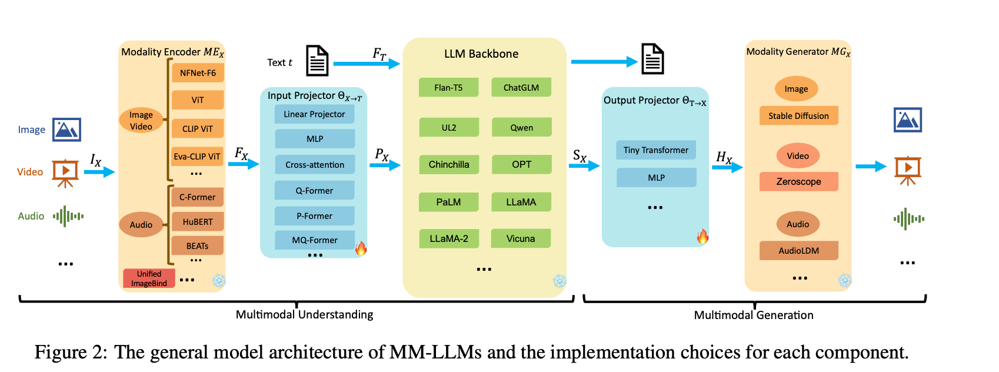

# 多模态概览 + 跑通一个 LLaVA Demo

## MM-LLMs综述

docs/notes/MM-LLMs- Recent Advances in MultiModal Large Language Models.pdf



MM-LLMs大部分遵循五个部分：

### **模态编码器（Modality Encoder, ME）**

- 功能：将来自不同模态（如图像、视频、音频等）的输入编码成特征表示。
- 实现：对于图像，常用的编码器有NFNet-F6、ViT、CLIP ViT和Eva-CLIP ViT。对于视频，视频通常被均匀采样成5帧图像，然后进行与图像相同的预处理。音频通常由C-Former、HuBERT、BEATs和Whisper等编码器处理。3D点云数据则由ULIP-2和PointBERT编码。

模态编码器负责将来自不同模态的输入转换为模型可以理解的特征表示：

**图像编码器（Image Encoder）**

- **NFNet-F6**：这是一个无归一化（normalizer-free）的ResNet变体，它使用了自适应梯度裁剪技术，允许在大量增强的数据集上进行训练，同时保持了高水平的图像识别性能。
- **ViT（Vision Transformer）**：ViT将Transformer架构应用于图像，通过将图像分割成小块（patches），然后进行线性投影和多层Transformer编码来处理图像。
- **CLIP ViT**：CLIP（Contrastive Language-Image Pre-training）结合了文本和图像，通过对比学习优化ViT，将成对的文本和图像视为正样本，其他视为负样本。
- **Eva-CLIP ViT**：Eva-CLIP是CLIP的稳定版本，它通过对比学习优化了大规模CLIP的训练和优化过程，为扩展和加速昂贵的多模态基础模型训练提供了新的方向。

**视频编码器（Video Encoder）**

- **UL2**：UL2（Universal Language Model 2）是一个编码器-解码器模型，它使用混合去噪目标进行训练，适用于视频内容的理解。

**音频编码器（Audio Encoder）**

- **C-Former**：C-Former使用CIF（Cross-Information Flow）对序列进行转录，并结合Transformer提取音频特征。
- **HuBERT**：HuBERT是一个自监督的语音表示学习框架，基于BERT，通过预测离散隐藏单元的掩蔽来实现。
- **BEATs**：BEATs是一个迭代的音频预训练框架，旨在从音频Transformer中学习双向编码器表示。
- **Whisper**：Whisper是一个大型的自监督语音识别模型，它使用大量的未标记数据进行训练。

**3D点云编码器（3D Point Cloud Encoder）**

- **ULIP-2**：ULIP-2（Universal Language Image Pre-training 2）是一个点云编码器，它结合了PointBERT作为其主干，用于处理3D点云数据。

这些模态编码器为MM-LLMs提供了处理和理解多种类型数据的能力，使得模型能够在多模态任务中有效地整合和利用来自不同源的信息。通过这些编码器，MM-LLMs能够更好地理解和生成与图像、视频、音频和3D数据相关的自然语言描述。

### **输入投影器（Input Projector, IP）**

- 功能：将模态编码器输出的特征与文本特征空间对齐，以便输入到LLM主干。
- 实现：可以通过线性投影器或多层感知器（MLP）实现，也可以使用更复杂的实现，如交叉注意力（Cross-attention）、Q-Former或P-Former。这些方法通过不同的机制将输入特征映射到LLM可以理解的表示空间。

**线性投影器（Linear Projector）**

- 线性投影器是最简单的输入投影器实现，它通过一个线性变换将模态编码器的输出特征映射到LLM主干的输入空间。这种投影器通常由一组可训练的权重矩阵组成，用于调整特征的维度和表示。

**多层感知器（Multi-Layer Perceptron, MLP）**：

- MLP是一种更复杂的输入投影器，它由多个线性层和非线性激活函数组成。MLP能够学习更复杂的特征转换，以更好地适应LLM主干的输入要求。

**交叉注意力（Cross-Attention）**：

- 交叉注意力是一种利用可训练的查询（queries）和模态编码器输出的特征（keys）来压缩特征序列的方法。压缩后的特征表示随后直接输入到LLM主干，或者用于与其他模态的交叉注意力融合。

**Q-Former**：

- Q-Former是一种特殊的输入投影器，它从模态编码器的输出特征中提取相关特征，并将这些特征用作LLM主干的输入。Q-Former通常需要一个单独的预训练过程来初始化。

**P-Former**：

- P-Former生成“参考提示”（reference prompts），对Q-Former产生的提示施加对齐约束。P-Former同样需要一个单独的预训练过程。

**Cross-attention with MLP**：

- 这种输入投影器结合了交叉注意力和多层感知器，使用交叉注意力提取模态特征，然后通过MLP进一步处理这些特征，以适应LLM主干的输入。

这些输入投影器的设计旨在提高模型对多模态输入的理解能力，使得MM-LLMs能够在处理图像、视频、音频等非文本数据时，与文本数据进行有效的交互。通过这些投影器，模型能够将不同模态的信息融合在一起，生成更加丰富和准确的输出。

### **LLM主干（LLM Backbone）**

- 功能：处理来自不同模态的表示，进行语义理解、推理和决策。
- 实现：LLM主干通常是基于预训练的文本模型，如GPT、BERT等。它能够处理多种模态的输入，并生成文本输出或信号令牌，指导模态生成器产生相应的多模态内容。

**Flan-T5**：

- Flan-T5是基于T5（Text-to-Text Transfer Transformer）模型的一个变体，它使用统一的文本到文本的训练方法来处理各种自然语言处理任务。Flan-T5展示了强大的零样本学习和链式推理（Chain-of-Thought, CoT）能力。

**ChatGLM**：

- ChatGLM是一个中英双语对话模型，基于GLM（Generative Language Model）架构，优化了中文问答和对话任务。它使用自回归掩蔽预测目标进行训练。

**UL2**：

- UL2（Universal Language Model 2）是一个基于编码器-解码器模型的训练模型，使用混合去噪目标进行训练，性能在多个基准测试中超过了T5。

**Qwen**：

- Qwen是一个在大规模和多样化数据集上训练的模型，专注于中文和英文，使用监督式微调（SFT）和基于人类反馈的强化学习（RLHF）技术进行对齐。

**Chinchilla**：

- Chinchilla是一个因果解码器，基于大量文本数据训练。它认为模型大小应随着训练标记数量的翻倍而翻倍。

**OPT**：

- OPT（Open Pre-trained Transformer）是一个GPT-3的克隆模型，旨在发布一个开源模型，复制GPT-3的性能。

**PaLM**：

- PaLM（Pathways Language Model）是一个具有并行注意力和前馈层的因果解码器结构，训练速度可达15倍。它包含了RoPE嵌入、SwiGLU激活、多查询注意力等显著变化。

**LLaMA**：

- LLaMA（Large Language Model Meta AI）包含仅解码器模型，具有高效的因果注意力。它专注于LLaMA-2-Chat模型的微调，以生成对话。

**Vicuna**：

- Vicuna是基于LLaMA构建的模型，利用http://ShareGPT.com上获取的用户对话数据进行训练，通过SFT进行优化。

### **输出投影器（Output Projector, OP）**

- 功能：将LLM主干产生的信号令牌映射成模态生成器可以理解的特征。
- 实现：通常由Tiny Transformer或MLP实现，这些投影器将信号令牌转换为条件文本表示，以便模态生成器生成相应的多模态内容。

**Tiny Transformer**：

- Tiny Transformer是一种轻量级的Transformer模型，它用于将LLM主干产生的信号令牌转换为模态生成器可以理解的特征。这种输出投影器通常具有较少的参数，以保持模型的计算效率。

**Multi-Layer Perceptron (MLP)**：

- MLP输出投影器由多个全连接层组成，每个层之间包含非线性激活函数。MLP能够学习复杂的非线性映射，将LLM的输出转换为适合特定模态的特征表示。

**Cross-attention with MLP**：

- 这种输出投影器结合了交叉注意力机制和多层感知器。它首先使用交叉注意力来捕捉LLM主干输出与模态特征之间的关联，然后通过MLP进一步处理这些特征，以生成高质量的多模态内容。

**Q-Former with Linear Projector**：

- 在某些MM-LLMs中，Q-Former提取模态编码器的特征，然后通过线性投影器将这些特征映射到LLM主干的输出。这种组合允许模型在生成过程中更好地利用模态信息。

**P-Former with Linear Projector**：

- 类似于Q-Former，P-Former生成参考提示，并通过线性投影器将这些提示映射到LLM主干的输出。P-Former确保生成的提示与模态特征保持一致，从而提高生成内容的质量。

**Cross-attention with Q-Former or P-Former**：

- 在某些实现中，输出投影器可能结合了交叉注意力和Q-Former或P-Former。这种设计允许模型在生成过程中同时考虑LLM主干的输出和模态特征，以生成更加准确和丰富的多模态内容。

输出投影器的设计对于MM-LLMs的性能至关重要，因为它们直接影响到模型生成内容的质量。通过这些投影器，MM-LLMs能够在保持文本生成能力的同时，有效地处理和生成图像、视频、音频等多模态数据。

### **模态生成器（Modality Generator, MG）**

- 功能：根据LLM主干的输出生成特定模态的输出，如图像、视频、音频等。
- 实现：对于图像，可以使用基于扩散模型（如Stable Diffusion）的生成器；对于视频，可以使用基于时间序列的生成器（如Zeroscope）；对于音频，可以使用基于音频变换器的生成器（如AudioLDM）。

## CLIP（Contrastive Language-Image Pre-training）

### 1. 整体结构

CLIP本质上是“两塔结构（dual-encoder）”：

- 图像编码器：  
  - 一般是 ResNet / Vision Transformer（ViT）  
  - 输入：图像  
  - 输出：图像全局向量 `v ∈ R^d`

- 文本编码器：  
  - Transformer（结构类似 GPT / BERT）  
  - 输入：文本（prompt：如“A photo of a dog”）  
  - 输出：文本向量 `t ∈ R^d`

- 对齐空间：
  - 通过训练，把图像和文本映射到同一个 d 维语义空间  
  - 相同语义的图文 pair 在该空间中距离接近，不同语义的距离远

### 2. 训练方式（对比学习）

- 数据：4亿规模的(图像, 描述文本)弱标注数据（来源于网络）  
- 目标：给定一个batch中的 N 张图和 N 段文本，  
  - 第 i 张图对应第 i 段文本，其他 N-1 个都是负样本  
  - 使用 InfoNCE 对比损失：
    - 图像→文本：图像特征与所有文本特征做相似度（cosine），拉高正样本，相对压低负样本  
    - 文本→图像：同理  
  - 实现“多对多”对比学习

### 3. 关键创新点

1. **大规模图文对比学习框架**：不用手工标注具体类别，只利用“图 + 文本描述”进行弱监督对齐。
2. **统一语义空间**：图文都在同一个 embedding 空间中，可以直接做：
   - 零样本分类：对每个类别写一个prompt，算与图像的相似度即可  
   - 图文检索：图→文 / 文→图  
3. **Prompt-based Zero-shot**：使用自然语言 prompt 来表达下游任务，而不用针对每个任务单独训练分类头。

## BLIP-2（Bootstrapping Language-Image Pre-training 2）

BLIP-2的关键词是：**利用现成的强大LLM，配一个视觉前端，通过轻量模块“胶水”粘起来**。

### 1. 整体结构

典型结构可分三块：

1. **视觉编码器（Frozen Vision Encoder）**
   - 通常是预训练 Vision Transformer（如 ViT / EVA / CLIP ViT）
   - 冻结参数，只做特征提取
   - 输出：一系列视觉token 或图像embedding

2. **Q-Former（Querying Transformer）——核心创新**
   - 这是 BLIP-2 的“桥接层”
   - 架构：一个小型 Transformer，内置一组可学习的 Query 向量（如 32/64 个）
   - 输入：
     - 视觉encoder输出的图像特征（冻结）
     - 一组可学习的 query tokens
   - 输出：
     - 若干“视觉压缩tokens”，作为图像在语言世界的紧凑表示
   - 训练时：Q-Former通过“跨模态预训练”学会如何从视觉特征中抽取对语言有用的信息

3. **大型语言模型（Frozen LLM）**
   - 例如：Flan-T5、OPT、Vicuna 之类  
   - 冻结参数，不改动LLM本身  
   - 通过一个线性映射 / MLP 将 Q-Former 输出的视觉tokens转成 LLM 接受的embedding，并作为前缀（prefix）喂给LLM。

简化流程：  
图像 → 冻结ViT → 特征 → Q-Former抽取若干视觉tokens → 线性投影 → 注入到LLM → LLM生成文本

### 2. 训练分阶段思想

BLIP-2采用“模块分治 + 冻结大模型”的策略，整体分三步：

1. 训练/使用强的视觉编码器（CLIP / EVA等）冻结  
2. 训练Q-Former：  
   - 目标：让Q-Former提取对语言任务友好的视觉表示  
   - 用现成的图文数据做：图文对齐、图文QA等  
3. 接入LLM：  
   - 冻结LLM，仅训练：  
     - Q-Former  
     - 视觉token到LLM embedding的投影层  
   - 通过图文对话、多轮QA数据微调

这样避免了直接端到端训练一个视觉+LLM的巨大模型的成本和不稳定性。

### 3. 关键创新点

1. **Q-Former：跨模态查询式Transformer**
   - 用少量可学习query来“询问”视觉特征，从中获得compressed、多模态语义表示。
   - 与简单平均/池化视觉特征相比，更灵活；与全量token拼接相比，更高效。

2. **“冷冻”大模型的模块化设计**
   - 视觉encoder、LLM全部冻结，只训练中间的小模块，参数效率极高。
   - 能很方便地“插拔”：换一个LLM，仅重训练小的桥接层。

3. **训练流水线清晰可控**
   - 分阶段训练，稳定且易扩展（比如替换视觉模型/LLM）。

## MiniGPT-4

MiniGPT-4的目标是：**用较小成本“模拟”GPT-4式的图文对话能力**，方案与LLaVA思想类似，但更早提出“简单投影层 + 强LLM + 高质量图文对话数据”。

### 1. 整体结构

通常的MiniGPT-4结构：

1. **视觉编码器**
   - 使用预训练的 ViT（多为 CLIP ViT）  
   - 冻结参数，输出视觉tokens

2. **图像特征对齐模块（Projection Layer / Q-Former-like）**
   - 最经典版本：一个简单的线性映射或者轻量的Transformer层  
   - 功能：把 CLIP 的视觉特征映射到 LLM 的词向量空间  
   - 与BLIP-2的Q-Former相比，MiniGPT-4中的模块更轻、更简，主要做线性映射而非复杂的Query机制

3. **LLM（Vicuna等）**
   - Vicuna是基于LLaMA的对话LLM  
   - 将映射后的视觉tokens插入到输入序列前部，之后仍由LLM进行统一的自回归生成。

结构总结：  
图像 → CLIP ViT → 特征 → 投影层 → LLM（Vicuna） → 生成答案/描述

### 2. 训练思路

MiniGPT-4的训练强调两个关键阶段（与LLaVA类似但更早强调）：

1. **阶段一：视觉特征对齐（Aligning Visual Features with LLM）**
   - 冻结CLIP与LLM，只训练投影层  
   - 使用约500K规模的图文对话数据（自建/爬取/处理）  
   - 目标：让LLM在看到映射后的视觉tokens时能做出合理、连贯的图像描述与简单问答

2. **阶段二：高质量多轮对话微调**
   - 使用更高质量、更精细标注的图像对话数据（包括人工写的对话/推理问答等）
   - 主要进一步提高“对话质量”和“推理能力”，包括：
     - 更细致的图像理解  
     - 层次化描述  
     - 结合图像内容进行推理/联想

### 3. 关键创新点

1. **极低成本搭建“GPT-4风格”多模态对话模型**
   - 在结构上的创新不算激进，核心是发现：  
     - “CLIP + 线性投影 + LLM + 好数据”就能做出非常强的多模态能力。
   - 比起复杂的Q-Former等模块，这条路线简单易复制。

2. **强调高质量图文对话数据的重要性**
   - 引入人工标注的高质量数据，通过指令式多轮对话训练，使模型表现出很“像人”的视觉对话风格。

3. **开源示范作用**
   - MiniGPT-4是最早公开展示“开源多模态ChatGPT效果”的项目之一，在社区影响力很大，推动后续LLaVA等项目发展。

## LLaVA（Large Language and Vision Assistant）

LLaVA的核心路线是：**LLM（如 LLaMA） + 视觉编码器（CLIP ViT） + 一个简单线性投影层，配合高质量多模态 instruction 数据**。

### 1. 整体结构

1. **视觉编码器**
   - 通常采用 CLIP 的 ViT-L/14 或类似  
   - 输入：图像  
   - 输出：一串视觉tokens（特征向量序列）

2. **视觉-语言投影层（Vision-Language Projector）**
   - 通常是一个 MLP / 线性层  
   - 将视觉tokens映射到 LLM 的词向量空间维度（d_model）  
   - 输出作为“前缀tokens”或特殊位置tokens注入LLM

3. **LLM（如 LLaMA / Vicuna）**
   - 原本是纯文本对话模型  
   - 现在能接受“视觉token + 文本token”作为输入，输出自然语言回答。

整体类似一个简单版本的 BLIP-2，但**没有Q-Former**，直接用视觉encoder的输出通过一个投影层对接到LLM。

### 2. 训练流程（两阶段）

1. **阶段一：特定的图文对齐训练（feature alignment）**
   - 冻结视觉编码器和LLM，仅训练投影层  
   - 使用图像-文本对（caption/QA等），目标是让LLM能利用投影后的视觉tokens做合理回答  
   - 这个阶段相当于学习“视觉tokens在LLM视角下的语义含义”

2. **阶段二：多模态 Instruction Tuning**
   - 构造（图像, 文本指令, 回答）三元组数据，如：
     - “请描述这张图中的主要场景”  
     - “这张图左边的人在做什么？”  
   - 对LLM进行监督微调（SFT），可能对LLM和投影层都做微调；有的版本只训投影层 + 部分LLM层。  
   - 目标：让模型在多模态指令下表现出对话式推理和交互能力。

### 3. 关键创新点

1. **极简结构 + 强调“指令微调数据”的重要性**
   - 在结构上相比BLIP-2更简单：直接用CLIP特征 + 线性投影接LLM。
   - 创新重点偏向“数据与训练范式”：使用生成的多轮图文对话数据+人工清洗数据进行instruction tuning，使模型具备“视觉助手”的行为模式。

2. **开源生态和“实用化多模态助手”范式**
   - LLaVA非常重视可复现和开源，推动了后续大量开源视觉-语言助手（如 LLaVA-1.5, LLaVA-NeXT）。
   - 引导了“LLM + 简单视觉前端 + 指令数据”的标准实践。

3. **善用已有CLIP特征**
   - 不需要引入复杂的中间模块，直接复用CLIP成熟的视觉语义抽取能力，搭建端到端对话系统。

## 对比与各自定位

### 1. 模型结构层面

- **CLIP**：  
  - 双编码器（图塔+文塔），各自独立，最后在向量空间对齐。  
  - 不生成语言，只是embedding对齐，用于检索/分类等。

- **BLIP-2**：  
  - 冻结视觉encoder + 冻结LLM，中间用 Q-Former 做桥接。  
  - Q-Former通过可学习queries，从视觉特征中提取对语言友好的压缩表示。  
  - 整体模块化程度高。

- **LLaVA / MiniGPT-4**（较相似）：  
  - 视觉encoder（多为CLIP） + 简单投影层 + LLM  
  - 不使用复杂Q-Former，直接把视觉tokens投影后送给LLM。  
  - 结构简单，训练主要依赖高质量指令数据。

### 2. 创新重心

- **CLIP**：  
  - 创新重点在于：  
    - 大规模图文对比预训练范式  
    - 零样本识别与统一嵌入空间
- **BLIP-2**：  
  - 创新重点在于：  
    - Q-Former作为跨模态query模块  
    - 冻结端（视觉 & LLM），只训练桥接层，实现高效多模态对齐
- **MiniGPT-4**： 
  - 创新重点在于：  
    - 证明“CLIP + 简单投影 + LLM + 高质量对话数据”即可达到类似GPT-4风格的多模态对话体验  
    - 强调数据构造与开源实验范例
- **LLaVA**：  
  - 创新重点在于：  
    - 极简架构 + 大量多模态instruction tuning  
    - 把“ChatGPT式对话范式”带入视觉领域

## 实验

llava结构探索

```python
from accelerate import init_empty_weights
from transformers import LlavaConfig, LlavaForConditionalGeneration

hf_model_path = "models/llava-1.5-7b-hf"

def test_llava_structure(hf_model_path):
    
    # 直接加载模型参数
    # model = LlavaForConditionalGeneration.from_pretrained(
    #     hf_model_path,
    #     torch_dtype="auto",
    #     device_map="auto",
    # )
    # print(model)

    
    # 使用 init_empty_weights()，只构建网络结构，不真正分配参数内存
    with init_empty_weights():
        config = LlavaConfig.from_pretrained(hf_model_path)
        model = LlavaForConditionalGeneration(config)

        # 打印模型结构
        print(model)

        # 打印参数总量（虽然是“空权重”，但 numel 信息是有的）
        total_params = sum(p.numel() for p in model.parameters())
        print(f"模型总参数量: {total_params / 1e6:.2f} M")

        # 打印部分参数名称和形状
        for name, param in list(model.named_parameters())[:50]:  # 想看更多改这个数字
            print(name, param.shape)

if __name__ == "__main__":
    test_llava_structure(hf_model_path)

```

llava的简单调用和推理

```python
import torch
from transformers import AutoProcessor, LlavaForConditionalGeneration
from PIL import Image

# 1. 模型和处理器
model_id = "models/llava-1.5-7b-hf"
device = "cuda" if torch.cuda.is_available() else "cpu"

model = LlavaForConditionalGeneration.from_pretrained(
    model_id, torch_dtype=torch.float16 if device == "cuda" else torch.float32
).to(device)
processor = AutoProcessor.from_pretrained(model_id)

# 2. 准备图片和文本
image = Image.open("week03_mllm_overview_llava_demo/code/image.png").convert("RGB") 
prompt = "USER: <image>\n请用中文描述这张图片。\nASSISTANT:"

inputs = processor(
    text=prompt,
    images=image,
    return_tensors="pt"
).to(device)

# 3. 推理
generate_ids = model.generate(
    **inputs,
    max_new_tokens=200
)

# 4. 解码输出
output = processor.batch_decode(generate_ids, skip_special_tokens=True)[0]
print(output)

# USER:  
# 请用中文描述这张图片。
# ASSISTANT: 这张图片展示了两个男人在一个城市街道上走路，他们正在跟着一个蓝色公交车。这辆公交车是一种电动车，并且有一个广告在其上方。另外，还有其他人在街道上走路，一个人在远处看起来很小。
```

自己搭建一个mini-llava，方便理解llava的数据流状态和推理原理

```python
import torch
from torch import nn
from transformers import CLIPImageProcessor
from transformers import (
    AutoTokenizer,
    LlavaForConditionalGeneration
)
from PIL import Image

# =========================
# 配置
# =========================
model_path = "models/llava-1.5-7b-hf"  # 本地 LLaVA 模型路径
device = "cuda"  # 使用 GPU
dtype = torch.float16  # 使用半精度加速推理

# =========================
# 手写 LLaVA
# =========================
class MyLLaVA(nn.Module):
    # 整体流程：
    # image → CLIP → patch features → projector → LLaMA embedding space
    # text → tokenizer → embedding
    # ↓
    # 拼接（用图像 embedding 替换 <image> token）
    # ↓
    # LLaMA → logits → decode
    def __init__(self, hf_model):
        super().__init__()

        # 直接复用 HuggingFace 模型里的子模块（已经包含训练好的权重）
        self.vision_tower = hf_model.vision_tower  # 图像编码器（CLIP）
        self.projector = hf_model.multi_modal_projector  # 多模态投影层
        self.llm = hf_model.language_model  # 语言模型（LlamaForCausalLM）
        self.config = hf_model.config  # 配置

    def encode_image(self, image_tensor):
        """
        输入:
            image_tensor: (B, 3, 336, 336)
        输出:
            (B, 576, 4096) 图像 patch 对应的 LLM embedding
        """
        outputs = self.vision_tower(
            image_tensor,
            output_hidden_states=True  # 输出所有中间层
        )

        # 取指定层的特征（LLaVA 配置里指定）
        feats = outputs.hidden_states[self.config.vision_feature_layer]

        # 去掉 CLS token，只保留 patch tokens
        feats = feats[:, 1:]

        # 通过 projector 映射到 LLM 的 embedding 维度
        feats = self.projector(feats)

        return feats

    def merge_embeddings(self, input_ids, image_embeds):
        """
        将 <image> token 替换为图像 embedding
        """
        # 获取文本 embedding
        inputs_embeds = self.llm.get_input_embeddings()(input_ids)

        B, T, D = inputs_embeds.shape  # batch, seq_len, hidden_dim
        _, N, _ = image_embeds.shape   # image patch 数量

        image_token_id = self.config.image_token_index  # <image> token 对应的 id

        merged = []

        # 遍历 batch
        for b in range(B):
            cur = []
            # 遍历每个 token
            for t in range(T):
                if input_ids[b, t] == image_token_id:
                    # 如果是 <image>，插入整块图像 embedding（576个patch）
                    cur.append(image_embeds[b])
                else:
                    # 普通 token，保留原 embedding
                    cur.append(inputs_embeds[b, t:t+1])
            # 拼接当前序列
            cur = torch.cat(cur, dim=0)
            merged.append(cur)

        # 对 batch 内不同长度做 padding
        max_len = max(x.shape[0] for x in merged)

        padded = []
        for x in merged:
            pad_len = max_len - x.shape[0]
            if pad_len > 0:
                # 用 0 填充
                pad = torch.zeros(pad_len, D, device=x.device, dtype=x.dtype)
                x = torch.cat([x, pad], dim=0)
            padded.append(x)

        # stack 成 batch
        return torch.stack(padded, dim=0)

    def forward(self, input_ids, image_tensor):
        # 图像编码
        image_embeds = self.encode_image(image_tensor)

        # 融合文本和图像 embedding
        inputs_embeds = self.merge_embeddings(input_ids, image_embeds)

        # 输入 LLM（直接用 embedding，不用 input_ids）
        outputs = self.llm(
            inputs_embeds=inputs_embeds,
            use_cache=False  # 不使用 KV cache（简单实现）
        )

        # 获取 logits（已经包含 lm_head）
        logits = outputs.logits 
        
        return logits


# =========================
# 生成函数（greedy 解码）
# =========================
@torch.no_grad()
def generate(model, tokenizer, input_ids, image_tensor, max_new_tokens=500):
    generated = input_ids  # 初始化生成序列

    for step in range(max_new_tokens):
        # 前向计算 logits
        logits = model(generated, image_tensor)

        # 取最后一个 token 的 logits，并选最大概率
        next_token = logits[:, -1, :].argmax(dim=-1, keepdim=True)

        # 拼接到生成序列
        generated = torch.cat([generated, next_token], dim=-1)

        # debug: 打印解码过程
        # print(tokenizer.decode(generated[0], skip_special_tokens=True), end="\r")
        
        # 如果生成 EOS token，提前结束
        if next_token.item() == tokenizer.eos_token_id:
            break

    return generated


# =========================
# 主函数
# =========================
def main():
    print("Loading HF model (for weights)...")
    # 加载 HuggingFace 官方模型（仅用于获取权重）
    hf_model = LlavaForConditionalGeneration.from_pretrained(
        model_path,
        torch_dtype=dtype,
        low_cpu_mem_usage=True
    ).to(device)

    hf_model.eval()

    print("Building custom model...")
    # 构建我们自己手写的 LLaVA
    model = MyLLaVA(hf_model).to(device).eval()

    print("Loading tokenizer & processor...")
    tokenizer = AutoTokenizer.from_pretrained(model_path)  # 文本 tokenizer
    processor = CLIPImageProcessor.from_pretrained(model_path)  # 图像预处理器

    # =========================
    # 构造输入
    # =========================
    prompt = "USER: <image>\n请用中文描述这张图片。\nASSISTANT:"

    # tokenizer 编码
    inputs = tokenizer(prompt, return_tensors="pt")
    input_ids = inputs["input_ids"].to(device)

    # =========================
    # 加载图片
    # =========================
    image = Image.open("week03_mllm_overview_llava_demo/code/image.png").convert("RGB")
    
    # debug（可用于检查 processor 是否正常）
    # out = processor(images=image, return_tensors="pt")
    # print(type(out), out)
    
    # 图像转 tensor
    image_tensor = processor(
        images=image,
        return_tensors="pt"
    )["pixel_values"].to(device, dtype)
    
    # print(image_tensor.shape)  # 应为 (1, 3, 336, 336)

    # =========================
    # 推理
    # =========================
    print("Generating...")
    output_ids = generate(model, tokenizer, input_ids, image_tensor)

    # 解码生成文本
    result = tokenizer.decode(output_ids[0], skip_special_tokens=True)

    print("\n===== RESULT =====")
    print(result)


if __name__ == "__main__":
    main()
```

