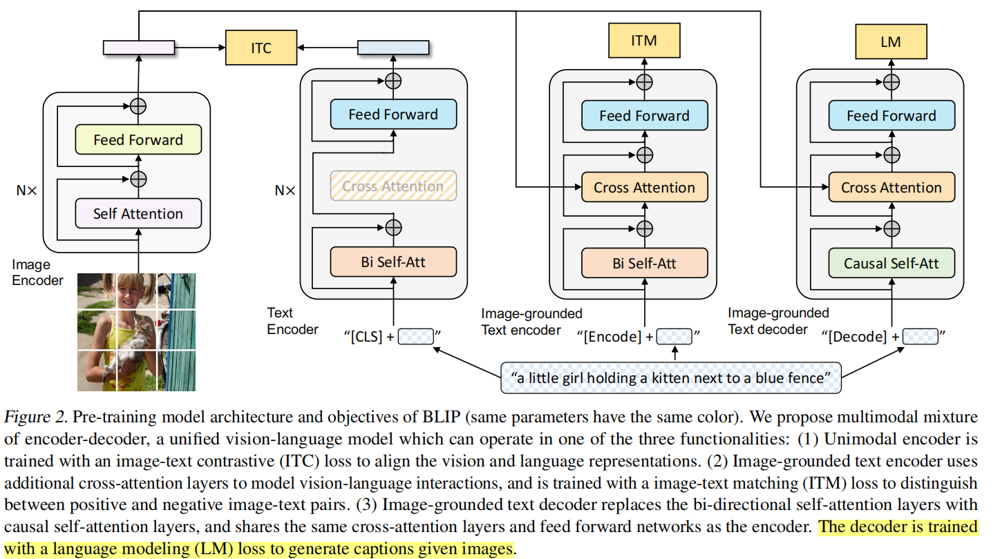

# BLIP / BLIP-2 Caption

## BLIP

BLIP（Bootstrapped Language-Image Pretraining），源自《BLIP: Bootstrapping Language-Image Pre-training for Unifified Vision-Language Understanding and Generation》



### MED

全称为Multimodal Mixture of Encoder-Decoder，是一个可以完成三个任务的复合型模型。

MED主要由四部分组成。图中相同颜色的部分共用参数。 
与CLIP类似，VIT作图像编码。
图像编码器的输出会流向以下三个不同的结构。

#### 1、ITC

这个结构类似BERT使用的编码器。将文本开头加入一个[CLS]token之后输入编码器进行编码，然后其输出与图片编码器的输出进行image-text contrastive任务。

这个任务本质就是对比学习的做法，ITC loss借鉴了ALBEF中的做法，引入动量编码器。
其实作者准备了两个编码器

1️⃣ 主编码器（student）正常训练，参与反向传播，参数：θ

2️⃣ 动量编码器（teacher）不参与反向传播，参数：θ_m，更新方式：

$$
\theta_m \leftarrow m \cdot \theta_m + (1 - m) \cdot \theta
$$
m 通常是 0.995 / 0.999

使用软标签可以让模型学习到更细粒度的语义信息，而不是简单地二值化判断

#### 2、ITM

这个编码器与上一个的唯一不同点就在于多加了一个cross attention(CA)操作。将图片编码器的输出embedding作为query，文本编码器中self attention(SA)之后的embedding作为key和value进行CA操作，这样可以学习到图片和文本的多模态表达以用于捕捉更加精细的视觉与语言之间的对应关系。

这个结构对应的则是image-text matching任务。这是一个二分类任务，通过添加一个线性层输出positive或者negative来表示图片和文本是否匹配。输入时，须在开头处添加[Encode]token表示起始

#### 3、LM

双向自注意力机制改为了因果自注意力机制，即Transformer中的decoder只与之前出现的token进行attention操作。这个结构是用于基于给定图片生成对应的文本描述。

它对应语言模型Language Modeling任务，损失函数是交叉熵。同样地，输入文本开头需要添加一个[Decode]token表示开头，结尾需要添加一个[EOS]字符。

训练方式和标准的文本生成模型（类似 GPT）是一样的，只不过它是以图像特征 + 文本前缀作为条件来生成文本。label就是文本序列本身（右移后的 token），也就是做teacher forcing的next-token prediction。

#### CapFilt

作者利用标注精准的数据集训练了一个BLIP后，利用BLIP的图像描述能力，在网图（标注不太准的数据集）中生成了较为准确的图像描述句子。再利用BLIP的图像文本比对能力做一次筛选。用洗过的数据又训了一次BLIP。也就是作者提到的boostrapping，自举法，先用准数据训练模型，用该模型洗数据后，再用于模型训练。

#### BLIP caption实验

```python
import torch
import torch.nn as nn
import torch.nn.functional as F

# ======================================
# 单层 Block（论文结构）
# Query 和 Text 共享 Self-Attn
# Cross-Attn 只作用在 Query 上
# ======================================
class QFormerBlock(nn.Module):
    def __init__(self, hidden_dim=768, num_heads=8, cross_attn=True):
        super().__init__()

        self.cross_attn_enabled = cross_attn

        # Self-Attn（Query + Text 一起）
        self.self_attn = nn.MultiheadAttention(hidden_dim, num_heads, batch_first=True)
        self.norm1 = nn.LayerNorm(hidden_dim)

        # Cross-Attn（只给 Query 用）
        if cross_attn:
            self.cross_attn = nn.MultiheadAttention(hidden_dim, num_heads, batch_first=True)
            self.norm2 = nn.LayerNorm(hidden_dim)

        # FFN
        self.ffn = nn.Sequential(
            nn.Linear(hidden_dim, hidden_dim * 4),
            nn.GELU(),
            nn.Linear(hidden_dim * 4, hidden_dim)
        )
        self.norm3 = nn.LayerNorm(hidden_dim)

    def forward(self, hidden_states, query_len, image_embeds, attn_mask=None):
        """
        hidden_states: [B, Q+T, D]
        query_len: Q
        """

        # -----------------------------
        # 1. Self-Attention（Q + T一起）
        # -----------------------------
        residual = hidden_states
        attn_out, _ = self.self_attn(
            hidden_states,
            hidden_states,
            hidden_states,
            attn_mask=attn_mask
        )
        hidden_states = self.norm1(residual + attn_out)

        # -----------------------------
        # 2. Cross-Attn（只作用 Query）
        # -----------------------------
        if self.cross_attn_enabled:
            q = hidden_states[:, :query_len, :]
            residual = q

            q_attn, _ = self.cross_attn(q, image_embeds, image_embeds)
            q = self.norm2(residual + q_attn)

            hidden_states = torch.cat([q, hidden_states[:, query_len:, :]], dim=1)

        # -----------------------------
        # 3. FFN（全部 token）
        # -----------------------------
        residual = hidden_states
        hidden_states = self.ffn(hidden_states)
        hidden_states = self.norm3(residual + hidden_states)

        return hidden_states


# ======================================
# Q-Former（完整版）
# ======================================
class QFormer(nn.Module):
    def __init__(
        self,
        vocab_size=30522,
        hidden_dim=768,
        num_queries=32,
        num_layers=12,
        num_heads=12,
        max_txt_len=64,
        cross_attn_freq=2
    ):
        super().__init__()

        self.num_queries = num_queries

        # ============================
        # Query Tokens（可学习）
        # ============================
        self.query_tokens = nn.Parameter(
            torch.randn(1, num_queries, hidden_dim)
        )

        # ============================
        # Text Embedding（论文用BERT）
        # ============================
        self.token_embed = nn.Embedding(vocab_size, hidden_dim)
        self.pos_embed = nn.Embedding(max_txt_len, hidden_dim)

        # ============================
        # Transformer Layers
        # ============================
        self.layers = nn.ModuleList()

        for i in range(num_layers):
            use_cross_attn = (i % cross_attn_freq == 0)
            self.layers.append(
                QFormerBlock(hidden_dim, num_heads, use_cross_attn)
            )

        self.norm = nn.LayerNorm(hidden_dim)

    # ======================================
    # 构造 Attention Mask（论文核心）
    # ======================================
    def build_attention_mask(self, query_len, text_len, mode):
        """
        mode:
            "itc" : query <-> query, text <-> text（隔离）
            "itm" : query <-> text（全连接）
            "itg" : text causal（生成）
        """
        total_len = query_len + text_len
        mask = torch.zeros(total_len, total_len)

        if mode == "itc":
            # Query 和 Text 不互相看
            mask[:query_len, query_len:] = float('-inf')
            mask[query_len:, :query_len] = float('-inf')

        elif mode == "itm":
            # 全部互相看
            pass

        elif mode == "itg":
            # 1️⃣ Text causal
            causal = torch.triu(
                torch.ones(text_len, text_len) * float('-inf'),
                diagonal=1
            )
            mask[query_len:, query_len:] = causal

            # 2️⃣ Text 不能看 Query
            mask[query_len:, :query_len] = float('-inf')

        return mask

    # ======================================
    # Forward
    # ======================================
    def forward(self, image_embeds, input_ids=None, mode="itm"):
        """
        image_embeds: [B, N, D]
        input_ids: [B, T]
        """

        B = image_embeds.size(0)

        # -----------------------------
        # Query
        # -----------------------------
        query_tokens = self.query_tokens.expand(B, -1, -1)
        query_len = query_tokens.size(1)

        # -----------------------------
        # Text
        # -----------------------------
        if input_ids is not None:
            T = input_ids.size(1)

            pos_ids = torch.arange(T, device=input_ids.device).unsqueeze(0)
            text_embeds = self.token_embed(input_ids) + self.pos_embed(pos_ids)

            hidden_states = torch.cat([query_tokens, text_embeds], dim=1)
            attn_mask = self.build_attention_mask(query_len, T, mode).to(input_ids.device)

        else:
            hidden_states = query_tokens
            attn_mask = None
            T = 0

        # -----------------------------
        # Transformer
        # -----------------------------
        for layer in self.layers:
            hidden_states = layer(
                hidden_states,
                query_len,
                image_embeds,
                attn_mask
            )

        hidden_states = self.norm(hidden_states)

        # -----------------------------
        # 输出拆分
        # -----------------------------
        query_output = hidden_states[:, :query_len, :]

        if input_ids is not None:
            text_output = hidden_states[:, query_len:, :]
            return query_output, text_output

        return query_output


# ======================================
# Dummy Vision Encoder
# ======================================
class DummyVisionEncoder(nn.Module):
    def __init__(self, img_dim=256, hidden_dim=768):
        super().__init__()
        self.linear = nn.Linear(img_dim, hidden_dim)

    def forward(self, x):
        x = self.linear(x)
        return x.unsqueeze(1).repeat(1, 16, 1)


# ======================================
# Demo
# ======================================
def demo():
    B = 2
    img = torch.randn(B, 256)
    text = torch.randint(0, 30522, (B, 10))

    vision = DummyVisionEncoder()
    qformer = QFormer()

    image_embeds = vision(img)

    # ITC
    q, t = qformer(image_embeds, text, mode="itc")
    print("ITC:", q.shape, t.shape)

    # ITM
    q, t = qformer(image_embeds, text, mode="itm")
    print("ITM:", q.shape, t.shape)

    # ITG
    q, t = qformer(image_embeds, text, mode="itg")
    print("ITG:", q.shape, t.shape)


if __name__ == "__main__":
    demo()

```

#### BeamSearch

核心思想：
每一步保留K个最优候选（K = num_beams）
假设：
num_beams = 2

**Step 1**：保留概率最高的2个词:

a (0.6)  
the (0.4)  

**Step 2**：扩展每个候选（计算的是条件概率）：  
模型生成一句话 ( y = (y_1, y_2, ..., y_T) ) 的概率是：
$$
P(y) = P(y_1) \cdot P(y_2 | y_1) \cdot P(y_3 | y_1, y_2) \cdots P(y_T | y_1,...,y_{T-1})
$$
每一步都是**条件概率**
a → a cat (0.3)
a → a dog (0.2)
the → the best (0.36)
the → the man (0.1)
计算方法，采用log相加的近似法
$$
\log P(y) = \log P(y_1) + \log P(y_2|y_1) + \cdots
$$
实际排序用的是：
$$
\text{score} = \sum_{t=1}^{T} \log P(y_t | y_{<t})
$$

**Step 3**：从所有候选中选 Top k(例如k=2)：
the best (0.36)
a cat (0.3)
**Step 4**：继续扩展……

**num_beams**  
优点  
比 Greedy 更准确  
能避免明显错误句子  
更稳定，不像采样那么随机

缺点  
计算成本高  
缺乏多样性，容易生成无聊句子  
不一定全局最优，仍是近似搜索，

## BLIP-2

#Q-former


Q-Former 不在每层使用 cross-attention，主要有三个原因：

1. 避免过度依赖视觉信息，保证语义逐层抽象
2. 保留语言模型结构，使输出更适配 LLM
3. 降低计算复杂度，提高训练稳定性

同时，间隔插入 cross-attention 可以形成
“信息提取 + 语义融合”的交替过程，从而更高效地完成跨模态对齐。

#### BLIP2 caption实验实验代码
```python
from transformers import Blip2Processor, Blip2ForConditionalGeneration
from PIL import Image
import torch

# ==============================
# 1. 加载模型和预处理器
# ==============================

processor = Blip2Processor.from_pretrained("models/blip2-flan-t5-xl")

model = Blip2ForConditionalGeneration.from_pretrained(
    "models/blip2-flan-t5-xl",
    torch_dtype=torch.float16  # 半精度
)

# ==============================
# 2. 加载图片
# ==============================

img_url = "week05_blip_blip2_caption/code/000000039769.jpg"
image = Image.open(img_url).convert("RGB")

# ==============================
# 3. 预处理输入
# ==============================

# BLIP-2 支持 prompt
prompt = "Question: What is in the image? Answer:"
#prompt = "Question: Describe the image in detail. Answer:"

inputs = processor(images=image, text=prompt, return_tensors="pt")

# ==============================
# 4. 将模型和数据移动到 GPU
# ==============================

device = "cuda" if torch.cuda.is_available() else "cpu"
model.to(device)

inputs = {k: v.to(device) for k, v in inputs.items()}

# ==============================
# 5. 生成 caption
# ==============================

with torch.no_grad():
    out = model.generate(
        **inputs,
        max_new_tokens=50,   # 注意这里是 max_new_tokens
        num_beams=5,
        temperature=1.0
    )

# ==============================
# 6. 解码输出
# ==============================

caption = processor.decode(out[0], skip_special_tokens=True)

# ==============================
# 7. 打印结果
# ==============================

print("Caption:", caption)
```

对比BLIP和BLIP2的结果令人吃惊  
BLIP的输出：  
two cats sleeping on a couch with a remote control  
BLIP2的输出：  
two cats  
当我用"Question: What is in the image? Answer:"的prompt给BLIP2，让他解释一下图片内容时，本以为会比BLIP2有大模型的加持，回答的会更丰富，但他却给我两个词。。。

当我换一个Prompt后"Question: Describe the image in detail. Answer:"，BLIP2的回答开始丰富了：  
Two cats are sleeping on a couch next to remotes  

对比后的结论：**不是BLIP2比BLIP弱，而是两种模型在做不同任务，所以输出风格完全不同。**  
BLIP的原生功能是**图像描述（Image Captioning）任务**  
专门训练成：看图，并生成**完整、自然、尽量详细的句子**，所以BLIP会**尽可能丰富地讲故事**  
BLIP2本质是在做 **视觉问答（VQA, Visual Question Answering）任务**  
先理解问题，再给出**最直接、最简洁的答案**  
对于第一个问题：What is in the image?，标准答案就是two cats  
所以BLIP2 本质是问答驱动的  
而BLIP：是端到端训练的caption模型，更偏生成描述  
BLIP更像是在看**图写话**，BLIP2更像是在**答题**


