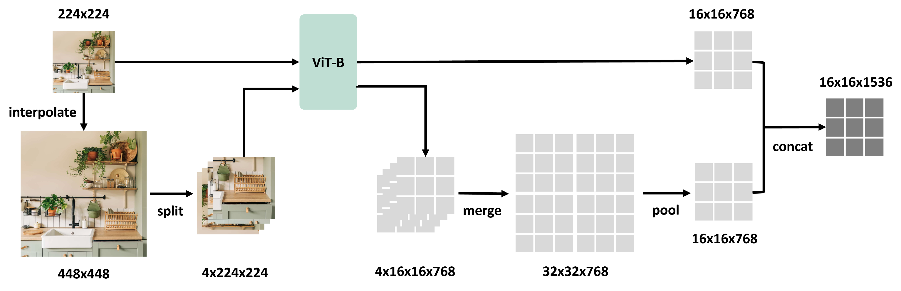

# minillava_refactor
本篇会重新梳理llava的结构细节，从源码出发再次理解llava的核心原理。结合week08的简单实现，重构代码为更合理的结构，并在此过程中加深对llava模型的印象，补充一些细节上的知识点。

## S2-Wrapper
llava的源码中，vision tower除了有标准的clip外还有一个s2版本，既多尺度图像特征提取。  

```python
class CLIPVisionTowerS2(CLIPVisionTower):
    def __init__(self, vision_tower, args, delay_load=False):
        super().__init__(vision_tower, args, delay_load)

        self.s2_scales = getattr(args, 's2_scales', '336,672,1008')
        self.s2_scales = list(map(int, self.s2_scales.split(',')))
        self.s2_scales.sort()
        self.s2_split_size = self.s2_scales[0]
        self.s2_image_size = self.s2_scales[-1]

        try:
            from s2wrapper import forward as multiscale_forward
        except ImportError:
            raise ImportError('Package s2wrapper not found! Please install by running: \npip install git+https://github.com/bfshi/scaling_on_scales.git')
        self.multiscale_forward = multiscale_forward

        # change resize/crop size in preprocessing to the largest image size in s2_scale
        if not delay_load or getattr(args, 'unfreeze_mm_vision_tower', False):
            self.image_processor.size['shortest_edge'] = self.s2_image_size
            self.image_processor.crop_size['height'] = self.image_processor.crop_size['width'] = self.s2_image_size

    def load_model(self, device_map=None):
        if self.is_loaded:
            print('{} is already loaded, `load_model` called again, skipping.'.format(self.vision_tower_name))
            return

        self.image_processor = CLIPImageProcessor.from_pretrained(self.vision_tower_name)
        self.vision_tower = CLIPVisionModel.from_pretrained(self.vision_tower_name, device_map=device_map)
        self.vision_tower.requires_grad_(False)

        self.image_processor.size['shortest_edge'] = self.s2_image_size
        self.image_processor.crop_size['height'] = self.image_processor.crop_size['width'] = self.s2_image_size

        self.is_loaded = True

    @torch.no_grad()
    def forward_feature(self, images):
        image_forward_outs = self.vision_tower(images.to(device=self.device, dtype=self.dtype), output_hidden_states=True)
        image_features = self.feature_select(image_forward_outs).to(images.dtype)
        return image_features

    @torch.no_grad()
    def forward(self, images):
        if type(images) is list:
            image_features = []
            for image in images:
                image_feature = self.multiscale_forward(self.forward_feature, image.unsqueeze(0), img_sizes=self.s2_scales, max_split_size=self.s2_split_size)
                image_features.append(image_feature)
        else:
            image_features = self.multiscale_forward(self.forward_feature, images, img_sizes=self.s2_scales, max_split_size=self.s2_split_size)

        return image_features

    @property
    def hidden_size(self):
        return self.config.hidden_size * len(self.s2_scales)
```
S2-Wrapper的核心思想是在任何视觉模型上实现多尺度特征提取。传统的视觉模型通常只在单一尺度上处理图像，而S2-Wrapper允许模型在多个尺度上提取特征，从而捕获更丰富的视觉信息。  
  
S2-Wrapper的工作流程可以概括为以下几个步骤：  
1、调整输入图像到不同尺度  
2、每个尺度的图像都通过相同的视觉模型进行处理  
3、合并不同尺度的特征，形成更加丰富的特征表示  

```python
image_feature = self.multiscale_forward(self.forward_feature, image.unsqueeze(0), img_sizes=self.s2_scales, max_split_size=self.s2_split_size)
```
这里的这一句是s2调用的精髓，其中img_sizes是个列表，代表输入图像不同尺度大小，max_split_size表示切块的大小。  

**为什么要split切块呢？**  
如果图太大，直接喂ViT后patch太多容易爆显存。所以一种直觉的方式是，将大图切成多块小图后，经过ViT得到小图feature在拼回元空间。  
**不同尺度的feature长度不同如何拼接？**  
例如：  
```python
outputs = [
    feat_336,
    feat_672,
    feat_1008
]
```

一般有三种方法：  
1、interpolation    
2、pooling  
3、patch re-alignment  

**interpolation**  
插值实现方法很简单，ViT输出通常是[B, N, D]，先reshape成[B, H, W, D]  
然后：  
```python
F.interpolate(feature_map, size=(H_target, W_target))
```  
本质是用连续空间假设，让token变密或变稀  
优点是简单，快，可微  
缺点是语义被拉伸，小目标可能变糊，且这种对齐不是真正对齐patch边界  

**pooling**  
高分辨率变低分辨率  
同理,这里可以用maxpool或avgpool  
```python
x = x.reshape(B, H, W, D)
x = avg_pool(x, kernel=2, stride=2)
```
优点是稳定，去噪，保留主要语义  
缺点是细节损失严重，小物体容易被吞掉，空间精度下降  

**patch re-alignment**  
每个ViT token都对应原图中的一个真实区域：
在多尺度时输入时，不同scale的token数不同，但它们其实都来自同一张原图。所以可以把token映射回原图坐标系再对齐。  
方法通常以下三种：  
coordinate mapping 图像空间对齐  
relative position 关系空间对齐  
grid projection 语义空间对齐  


## mini LLaVA 的其他细节

### 一、Feature Select：该取哪一层的 hidden state？

CLIP Vision Tower 的 forward 中会有一步 `self.feature_select`，这个函数的作用是从 ViT 的多层 hidden state 中选择实际使用的特征。LLaVA 源码中有两种配置：

```python
# 方式1：取最后一层（最常用）
image_features = image_forward_outs.last_hidden_state  # (B, 1+patch_num, D)

# 方式2：取倒数第二层（base版本默认）
image_features = image_forward_outs.hidden_states[-2]  # 可以拿到每一层输出
```

**为什么 last_hidden_state 要去掉cls？**  
CLS 更偏全局摘要，MiniLLaVA 需要给 LLM 更细粒度的图像信息，因此去掉 CLS，只保留 patch token 作为视觉上下文。

**关键代码**：  
```python
def forward(self, images):
        """将 PIL 图片列表编码为 patch 级视觉特征。

        Args:
            images: List[PIL.Image]，长度为 batch size。

        Returns:
            Tensor，形状为 (B, N, D)。以 CLIP ViT-B/16 为例，224x224 图片会得到
            14x14=196 个 patch，每个 patch 维度为 768。
        """
        inputs = self.processor(images=images, return_tensors="pt")
        pixel_values = inputs["pixel_values"].to(self.device)

        # 冻结视觉塔时关闭梯度，节省显存；不冻结时保留梯度用于端到端微调。
        if self.freeze:
            with torch.no_grad():
                outputs = self.vision_model(pixel_values=pixel_values)
        else:
            outputs = self.vision_model(pixel_values=pixel_values)

        # last_hidden_state 形状为 (B, 1 + patch_num, hidden_dim)，第 0 个是 CLS。
        # CLS 更偏全局摘要，MiniLLaVA 需要给 LLM 更细粒度的图像信息，因此去掉 CLS，
        # 只保留 patch token 作为视觉上下文。
        patch_features = outputs.last_hidden_state[:, 1:, :]
        return patch_features
```


这个设计体现了**视觉特征粒度与语义之间的权衡**，CLS 更偏全局摘要，patch 更保留空间结构。

---

### 二、Projector 的设计细节

LLaVA 源码中的 projector 是一个简单的两层 MLP，但有几个关键设计决策：

#### 2.1 为什么不用单层线性投影？

LLaVA 论文实验表明，两层 MLP（带 GELU 激活）比单层线性投影效果好约 3% 以上。原因是视觉特征空间和语言特征空间差异很大，单层线性变换表达能力不足，非线性变换可以提供更好的语义对齐能力。

#### 2.2 LayerNorm 的位置

```python
# LLaVA 源码中 projector 的标准结构
self.linear_1 = nn.Linear(config.mm_hidden_size, config.mm_mlp_dim)
self.linear_2 = nn.Linear(config.mm_mlp_dim, config.hidden_size)
self.gelu = nn.GELU()
self.layer_norm = nn.LayerNorm(config.hidden_size)
```

注意 LayerNorm 加在**输出端**，而不是中间隐藏层之后。原因是：
- 视觉特征经过映射后通过 LayerNorm 可以稳定进入 LLM 的 embedding 空间分布
- LLM 的词向量通常也有 LayerNorm，让视觉特征的分布与文本 embedding 分布更一致

#### 2.3 初始化的讲究

```python
# MiniLLaVA 中的 xavier 初始化
def init_weights(self):
    for m in self.modules():
        if isinstance(m, torch.nn.Linear):
            torch.nn.init.xavier_uniform_(m.weight)
            if m.bias is not None:
                torch.nn.init.zeros_(m.bias)
```

LLaVA 官方源码使用默认初始化（PyTorch Linear 层的 Kaiming Uniform），但显式初始化的好处是：
- 避免训练初期 projector 输出分布偏移过大
- 让视觉特征在进入 LLM 之前的 scale 更加稳定

训练时，LLaVA 会先通过**预热阶段**（warmup）让 projector 逐步适应特征分布。

---

### 三、Labels 构造：-100 屏蔽的艺术

这是多模态训练中最重要的细节之一。在 LLaVA 的 collator 中，labels 的构造需要遵循严格规则：

```
完整序列: [img_patches] [prompt_tokens] [answer_tokens] [pad_tokens]
labels:    [-100]...      [-100]...        [answer_ids]...  [-100]...
```

```python
# 核心逻辑
def __call__(self, features):
        images = [x["image"] for x in features]
        prompts = [x["prompt"] for x in features]
        answers = [x["answer"] for x in features]

        # eos 可以明确告诉模型回答结束；如果 tokenizer 没有 eos，就退化为空字符串。
        eos = self.tokenizer.eos_token or ""
        full_texts = [prompt + answer + eos for prompt, answer in zip(prompts, answers)]

        tokenized = self.tokenizer(
            full_texts, 
            padding=True,
            truncation=True,
            max_length=self.max_length,
            return_tensors="pt"
        )

        labels = tokenized.input_ids.clone()

        # 逐条计算 prompt token 长度，并把 prompt 位置 label 屏蔽为 -100。
        for row, prompt in enumerate(prompts):
            prompt_ids = self.tokenizer(
                prompt,
                truncation=True,
                max_length=self.max_length,
                add_special_tokens=True
            ).input_ids
            prompt_len = min(len(prompt_ids), labels.size(1))
            labels[row, :prompt_len] = -100

        # padding 不参与训练损失。
        labels[tokenized.attention_mask == 0] = -100

        return {
            "images": images,
            "input_ids": tokenized.input_ids,
            "attention_mask": tokenized.attention_mask,
            "labels": labels
        }
```

**为什么 prompt 部分必须屏蔽 loss？**
- 因果语言模型的 CrossEntropyLoss 对所有 token 位置都计算 loss
- 如果 prompt 部分不屏蔽，模型会学习"预测用户问题"的无意义任务
- LLaVA 只需要学习"在看到图像和问题后，如何生成正确回答"

**image token 的 -100 屏蔽**：
在 `mini_llava.py` 的 forward 中还有一道屏障：
```python
# 图片部分全部置 -100
image_labels = torch.full(
    (labels.size(0), image_token_num),
    -100,
    dtype=torch.long,
    device=self.device
)
labels = torch.cat([image_labels, labels], dim=1)
```
这是因为视觉 token 是连续 embedding（不是离散 token id），无法参与 CrossEntropyLoss。

---

### 四、LLaVA 的两阶段训练策略

源码中通过配置文件控制两阶段训练，这是 LLaVA 和其他多模态模型的重要区别：

| 阶段 | 视觉塔 | Projector | LLM | 学习率 |
|------|--------|-----------|-----|--------|
| Stage 1 (Pre-training) | ❌ 冻结 | ✅ 训练 | ❌ 冻结 | 1e-3 |
| Stage 2 (Fine-tuning) | ❌ 冻结 | ✅ 训练 | ✅ 训练(LoRA) | 2e-5 |

**Stage 1 的目的**：  
只训练 projector，让视觉特征能"翻译"到 LLM 的 embedding 空间。这一步用的是 CC3M 等图文对数据，监督信号是语言模型预测 caption 的 loss。

**Stage 2 的目的**：  
解冻 LLM（或部分解冻），让模型学习更复杂的指令跟随和视觉推理能力。这一步使用 LLaVA-Instruct-150K 等指令数据。

**关键参数**：
```python
# 配置文件中的 freeze 控制
VISION_ENCODER:
    FREEZE: true    # 视觉塔通常全程冻结
LLM_DECODER: 
    FREEZE: false   # Stage 2 解冻（或通过 LoRA 部分解冻）
```

这种"先对齐视觉语义，再联合微调"的思路也被 BLIP-2、MiniGPT-4 等模型沿用。

---

### 五、LoRA 在多模态模型中的注意事项

LLaVA 微调时使用 LoRA 有几个关键点需要留意：

#### 5.1 LoRA 到底作用于 LLM 的哪些层？

```python
# LLaVA 中的 LoRA 配置通常作用于 attention 模块
self.peft_config = LoraConfig(
    task_type=TaskType.CAUSAL_LM,
    r=r,
    lora_alpha=lora_alpha,
    lora_dropout=lora_dropout,
    # target_modules: 'q_proj', 'v_proj' 或全部线性层
    target_modules=['q_proj', 'v_proj', 'k_proj', 'o_proj']
)
```

**为什么不把所有参数都解冻来微调？**  
- 显存限制：LLM 参数量巨大（7B、13B），全参数微调需要多卡
- 灾难性遗忘：完全微调可能导致 LLM 丢失预训练语言能力
- LoRA 用低秩适配矩阵 ΔW 来模拟参数更新，训练参数量减少 1000 倍以上

#### 5.2 LoRA 和 Projector 的协同

通过 `should_save_param` 函数可以看到，checkpoint 需要同时保存 projector 和 LoRA 参数：
```python
def should_save_param(name, param):
    name = name.lower()
    return param.requires_grad or "lora_" in name or ".lora_" in name
```
这里用 `requires_grad` 捕获 projector 参数，用 `lora_` 关键字捕获 PEFT 包的 LoRA 参数。

---

### 六、Tokenizer 的特殊处理

因果语言模型（Causal LM）的 tokenizer 经常没有 pad_token_id，但训练时 batch 内序列长度不同必须做 padding。LLaVA 源码中惯用的解决方案：

```python
# 方案1：用 eos_token 代替 pad_token（最常用）
if self.tokenizer.pad_token_id is None:
    self.tokenizer.pad_token = self.tokenizer.eos_token

# 方案2：显式设置 pad_token
# self.tokenizer.add_special_tokens({'pad_token': '[PAD]'})
# 但增加新 token 后需要 resize 词表：model.resize_token_embeddings(len(tokenizer))
```

**用 eos 代替 pad 为什么不影响训练？**  
因为 padding 位置会被 attention_mask 屏蔽（注意力机制看不到），loss 也用 -100 屏蔽了，所以 padding token 的具体值不影响训练效果。但必须注意在 generate 阶段 pad_token_id 需要正确设置，否则模型可能把 pad 当作有效 token 来生成。

**tokenizer 的 trust_remote_code 参数**：
```python
self.model = AutoModelForCausalLM.from_pretrained(
    model_path,
    trust_remote_code=True  # 兼容部分国产模型仓库的自定义实现
)
```
对于 Qwen、ChatGLM 等非 huggingface 原生结构，需要 `trust_remote_code=True` 来允许执行模型仓库中的自定义 Python 代码。

---

### 七、多模态 Embedding 拼接的原理

这是理解 LLaVA 核心架构最关键的一步。LLM 原本只能接收 `input_ids`（离散 token），但 LLaVA 通过 `inputs_embeds` 接口绕过了这一限制：

```python
# 标准 LLM forward：走 input_ids 路径
# 根据 token id 查 embedding table，得到 [batch, seq_len, hidden_dim]
outputs = self.model(input_ids=input_ids, ...)

# LLaVA 的 forward：走 inputs_embeds 路径
# 由外部拼好 embedding 后直接传入
outputs = self.model(inputs_embeds=inputs_embeds, ...)
```

**视觉与文本的拼接流程**：  
```
1. 图片 → CLIP ViT → [B, 196, 768] patch_features  
2. patch_features → Projector → [B, 196, 2048] projected_visual  
3. 文本 → tokenizer → input_ids → embedding_table → [B, L, 2048] text_embed  
4. 拼接: concat(projected_visual, text_embed, dim=1) → [B, 196+L, 2048]  
5. 扩展 attention_mask: concat(ones(196), text_mask, dim=1) → [B, 196+L]
```

**关键理解**：  
对于 LLM 来说，视觉 token 和文本 token 在输入层没有区别——它们都是 `[B, N, hidden_dim]` 的 continuous embedding。LLM 自动对它们施加同样的 causal attention，视觉 token 在 attention 计算中会被当作"前置上下文"。

---

### 八、Training 阶段的梯度流控制

训练时需要清楚哪些参数参与梯度计算：

```
image → [CLIP ViT (冻结, no_grad)] → patch_features → [Projector] → proj_features ─┐  
                                                                                      ├→ concat → [LLM (LoRA)] → logits → loss  
text → [tokenizer + embedding (冻结)] → text_embeds ──────────────────────────────────┘  
```

**梯度流经的路径**：  
1. loss.backward() → LLM 的 LoRA 参数（A 和 B 矩阵）获得梯度
2. loss.backward() → Projector 的两层 Linear 获得梯度
3. CLIP ViT 被 `torch.no_grad()` 或 `requires_grad=False` 包裹，梯度到此为止
4. 文本 embedding table 通常也被冻结，不参与更新

**为什么冻结视觉塔？**  
- CLIP ViT 是在 4 亿图文对上预训练的，视觉特征已经很通用
- 小数据集上微调视觉塔反而容易过拟合，破坏预训练的视觉语义
- 端到端训练视觉塔对显存消耗极大（ViT-L 有 300M+ 参数）

---

### 九、Generation 阶段的 KV Cache

训练时设置 `use_cache=False`，生成时使用 KV Cache 加速：

```python
# 训练阶段：不使用 KV Cache，每步计算完整的因果 attention
outputs = self.language_decoder(
    inputs_embeds=inputs_embeds,
    attention_mask=combined_attention_mask,
    labels=labels,
    use_cache=False
)

# 生成阶段：自动使用 KV Cache
output_ids = self.language_decoder.model.generate(
    inputs_embeds=inputs_embeds,
    attention_mask=attention_mask,
    max_new_tokens=max_new_tokens,
    use_cache=True  # generate 函数默认启用
)
```

**KV Cache 在多模态场景的特有问题**：
- 视觉 token（196个）作为 prefix，它们的 K/V 在生成过程中保持不变
- 每次新 token 只需要计算新 token 与全部 prefix + history 的 attention
- 多模态场景下 prefix 长度（196个视觉 token + prompt token）显著长于纯文本场景，KV Cache 的加速效果更明显

---

### 十、AnyRes：高分辨率图像的处理

LLaVA-1.5 引入的一种替代 S2-Wrapper 的方式，用于支持高分辨率图像。核心思路是将高分辨率图像切分成 grid 子图，每个子图独立过 ViT，再组合特征。

```
┌──────┬──────┐
│cell(1,1) │cell(1,2)│
├──────┼──────┤    每一个cell过ViT，得到特征token
│cell(2,1) │cell(2,2)│
└──────┴──────┘
          原始图 + 2x2 grid = 5张子图
```

```python
# LLaVA-1.5 中 AnyRes 的关键思路：
# 1. 对原始图做 center crop 得到 base_image (336x336)
# 2. 将原始图 resize 到合适大小后切分成 n 个 336x336 的子图
# 3. 每张子图 + base_image 分别送入 ViT
# 4. 所有特征拼成一个大序列送入 LLM
```

**AnyRes vs S2-Wrapper 的区别**：
- S2-Wrapper 是在**多尺度**上做特征提取，然后合并
- AnyRes 是把**大图切成小块**分别提取特征，然后拼回原图空间网格
- AnyRes 产生的 token 数更多（一张 672x672 的图产生 (2*2+1) * (336/14)^2 = 5 * 576 = 2880 个 token）

---

### 十一、Delay Load 机制

LLaVA 源码中有一个 `delay_load` 参数，控制 vision tower 是否在初始化时立刻加载：

```python
class CLIPVisionTower(nn.Module):
    def __init__(self, vision_tower, args, delay_load=False):
        super().__init__()
        self.is_loaded = False
        
        if not delay_load:
            # 立即加载：训练时使用
            self.load_model()
        # 延迟加载：推理时先用轻量配置，用到视觉塔时再加载
```

**为什么要 delay load？**  
在多卡分布式训练中，如果所有进程在初始化时就加载视觉模型，会造成不必要的显存占用。通过 delay_load，视觉塔可以在 `accelerator.prepare` 之后才加载，优化显存分配。这也和 LLaVA 的"先做 projector 对齐，再端到端训练"的哲学一致。

---

### 十二、Config-driven 架构设计的启示

从 `config.yaml` 可以看到 LLaVA 风格的训练脚本是如何参数化的：

**配置分层原则**：
```yaml
# 按模块划分配置域，每个域独立可配置
MINILLAVA:           # 模型结构参数
  VISION_ENCODER: ...   
  LLM_DECODER: ...     
  PROJECTOR: ...       

DATA:                # 数据参数
  TRAIN_DATASET: ...   
  PREPROCESS: ...      

TRAINING:            # 训练参数
  OPTIMIZER: ...       
  SCHEDULER: ...       
```

**这样设计的好处**：
- 不同实验只需改 YAML，不碰代码
- 每个模块的参数内聚，修改一个域不影响其他域
- 便于后续扩展（比如增加 AnyRes 配置项、S2 配置项）

**实践中易踩的坑**：  
YAML 中的数字类型要小心。`LR: 1e-4` 会被解析成 float，但如果写成 `SAVE_STEPS: 500` 会使 int，后面如果是除法要注意类型。在 `train.py` 中通过 `int()` 和 `float()` 做显式转换是好的习惯。

---

### 十三、Accelerate 分布式训练的适配细节

```python
from accelerate import Accelerator

accelerator = Accelerator()
model, optimizer, dataloader = accelerator.prepare(model, optimizer, dataloader)
```

**Accelerator 在多模态训练中的几个关键配合**：

1. **loss 聚合**：
```python
# 多卡训练时，每张卡的 loss 是局部 batch 的
# accelerator.gather_for_metrics 会收集所有卡的 loss 并求平均
loss_value = accelerator.gather_for_metrics(loss.detach()).mean().item()
```

2. **checkpoint 保存**：
```python
if not accelerator.is_main_process:
    return  # 只有主进程保存 checkpoint
unwrapped_model = accelerator.unwrap_model(model)  # 解开 DDP 包装
```

3. **seed 同步**：
```python
accelerate_set_seed(seed)  # 保证多卡场景下数据 shuffle 一致
```

**为什么要用 accelerator.unwrap_model**？  
`accelerator.prepare` 后的 model 可能被 `DistributedDataParallel` 包装，此时 `model.named_parameters()` 获取的参数名会带有 `module.` 前缀。`unwrap_model` 可以拿到原始模型，确保 checkpoint 中的参数名与初始化时一致，方便加载。

---

### 十四、数据格式：LLaVA 的 conversation 结构

LLaVA 的预训练数据（CC3M）和指令微调数据（LLaVA-Instruct-150K）使用不同的对话格式：

**预训练数据格式**（CC3M）：
```json
{
  "image": "xxx.jpg",
  "conversations": [
    {"from": "human", "value": "What is this?"},
    {"from": "gpt", "value": "This is a photo of a cat."}
  ]
}
```

**指令微调数据格式**（LLaVA-Instruct）：
```json
{
  "image": "xxx.jpg",
  "conversations": [
    {"from": "human", "value": "<image>\nDescribe this image in detail."},
    {"from": "gpt", "value": "The image shows..."},
    {"from": "human", "value": "What color is the car?"},
    {"from": "gpt", "value": "The car is red."}
  ]
}
```

**多轮对话的处理**：
- 第一轮是"看图描述"类型任务
- 后续轮次是"基于视觉上下文的问答"
- 每轮只监督 gpt 的回答部分，human 部分和视觉 token 全部 -100

**`<image>` 占位符的清理**：
```python
def _clean_text(text):
    return text.replace("<image>", "").strip()
```
因为图片已经作为视觉 token 拼在了序列最前面，文本中不需要再保留 `<image>` 标记。

---

### 十五、总结：LLaVA 的可学习参数与内存分析

假设使用 CLIP ViT-B/16 (86M) + Qwen1.5-1.8B (1.8B)：

| 模块 | 参数量 | freeze? | 显存占用 |
|------|--------|---------|----------|
| CLIP ViT | 86M | ✅ | ~344MB (推理) |
| Projector | 768×2048 + 2048×2048 ≈ 5.8M | ❌ | ~23MB |
| LLM (Qwen1.5) | 1.8B | 部分(LoRA) | ~7.2GB (bf16) |
| LoRA adapter | r×d × 4 ≈ 0.5M (r=8) | ❌ | ~2MB |
| Optimizer States (AdamW) | ~12M | - | ~48MB |
| **总计** | **~1.9B** | **训练 ~6.3M** | **~7.6GB + 输入缓存** |

**为什么 LoRA 能省这么多显存？**  
- 全参数微调需要保存所有 1.8B 参数的优化器状态（动量和方差），显存翻倍
- LoRA 只优化 0.5M 的 A/B 矩阵，优化器状态可忽略
- 梯度也只对 LoRA 参数有效，反向传播的中间激活更少

这也是 LLaVA 系列能在单卡 24GB 显存上完成微调的原因。