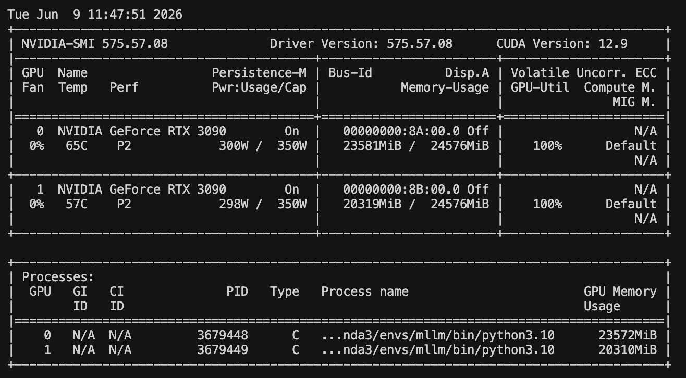

# week13_chat_format_alignment

之前我们将 caption和qa、vqa格式的数据都统一成了OpenAI Chat 风格的多轮 messages 格式，但不是完整意义上的 system/user/assistant 三角色模板。

它目前只有 user/assistant，system 被省略了。对于 SFT 通常可以接受，因为 system 是可选的。

为了更严格的对齐三角色规范，需要在脚本里给每条样本开头加一条 system message。

而每次都加同样的system message又使得模型很死板，我们随机生成一些selected_system_message，每次随机选择一个system message，并把他放在每条样本的开头。
训练时拼成模型实际输入，大概是：

```text
<system>
You are a helpful visual assistant. Answer the user's questions based on the image.
</system>
<user>
<image>
What is in the image?
</user>
<assistant>
A dog is running on the grass.
</assistant>
```

这里需要注意，即使增加了system message，它也同样不参与loss 梯度的反向传播，只参与attention，影响assistant的输出即可。

规律就是只有模型预测出来的文字才需要参与loss梯度的反向传播，其余的对话当做条件即可。


```text
system tokens      -> label = -100
user tokens        -> label = -100
image tokens       -> label = -100
assistant tokens   -> 正常 label
```

## Convert

```shell
python week13_chat_format_alignment/utils/convert_qa_to_openai_chat.py --input dataset/VQA/abstract_v002_val2017_qa.json --output dataset/VQA/abstract_v002_val2017_multiturn_system.json --image-prefix scene_img_abstract_v002_val2017 --keep-single-turn --no-rewrite-repeated-questions 

python week13_chat_format_alignment/utils/convert_qa_to_openai_chat.py --input dataset/LLaVA-CC3M-Pretrain-595K/chat.json --output dataset/LLaVA-CC3M-Pretrain-595K/chat_multiturn_system.json --image-prefix images --keep-single-turn --no-rewrite-repeated-questions 

python week13_chat_format_alignment/utils/convert_qa_to_openai_chat.py --input dataset/COCOCaption/annotations/captions_val2017_qa.json --output dataset/COCOCaption/annotations/captions_val2017_multiturn_system.json --image-prefix val2017 --keep-single-turn --no-rewrite-repeated-questions 

```

## Train
```shell
accelerate launch --multi_gpu week13_chat_format_alignment/code/train.py --config week13_chat_format_alignment/configs/multitask_balanced.yaml
```

