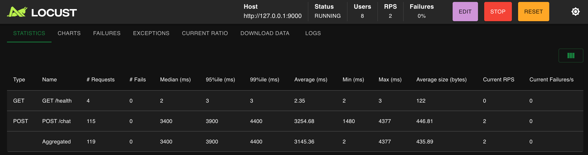
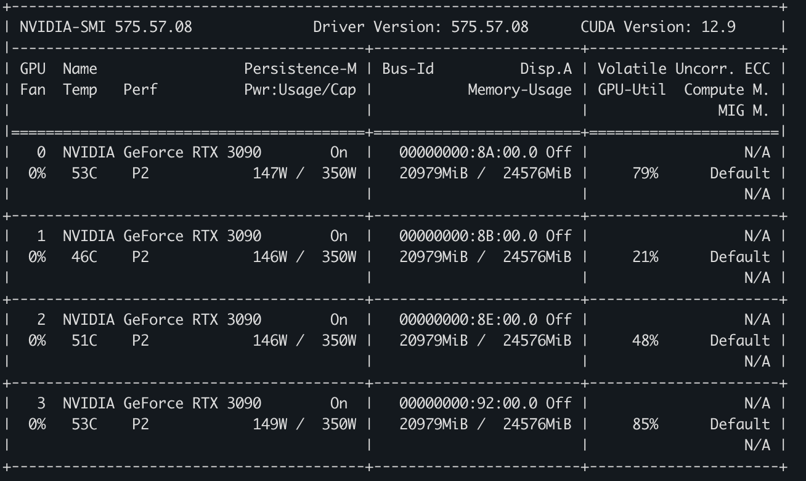

# week20_benchmark_optimization

这周对我们之前部署的大模型服务进行压测，压测可以在本地端快速验证模型上线后的峰值能力，在上线前做一次有效的压测能够对模型性能有充足的理解，便于模型的优化和设备性能瓶颈的摸底。

压测相关的库`locust`、`wrk`、`ab` 都能做 HTTP 压测，但定位明显不同：

| 工具       | 核心定位               | 压测模型             | 脚本能力            | 性能/并发              | 分布式     |
| ---------- | ---------------------- | -------------------- | ------------------- | ---------------------- | ---------- |
| **ab**     | 快速验证单个接口       | 固定请求数 + 并发数  | 很弱                | 较低                   | 不支持     |
| **wrk**    | 测单接口的极限吞吐     | 多线程 + 事件驱动    | Lua，可动态生成请求 | 很高                   | 原生不支持 |
| **Locust** | 模拟真实用户和业务流程 | 虚拟用户持续执行任务 | Python，能力强      | 较高，但压测端开销更大 | 原生支持   |

## locust、wrk、ab 库

ab：最简单的快速基准

```bash
ab -n 10000 -c 100 -k http://127.0.0.1:8080/api
```

- `-n`：总请求数
- `-c`：并发请求数
- `-k`：启用 Keep-Alive

优点：

- 安装和使用简单
- 适合快速检查接口性能是否明显退化
- 输出容易理解

缺点：

- 功能简单，压测端本身容易先到瓶颈
- 不适合高并发或复杂业务流程
- 请求参数、认证、动态数据支持较弱
- 默认行为可能和生产客户端差异较大

适合：开发阶段快速跑一下单个接口，或者做简单版本对比。

---

wrk：测单接口的吞吐极限

```bash
wrk -t8 -c500 -d30s --latency http://127.0.0.1:8080/api
```

- `-t8`：8 个压测线程
- `-c500`：500 个连接
- `-d30s`：持续 30 秒
- `--latency`：输出延迟分布

优点：

- 多线程、事件驱动，压测端效率非常高
- 单机可以产生很大的请求量
- 适合测试服务的最大 QPS、连接处理能力和延迟
- 支持 Lua 脚本，自定义请求内容

缺点：

- 复杂业务场景的编排能力有限
- 原生没有控制台和分布式调度
- Lua 脚本不如 Python 生态方便
- 经典 `wrk` 采用闭环请求模型，服务变慢时发压速率也会下降；延迟结果可能受到 coordinated omission 影响

---

Locust：能够模拟真实用户行为

```python
from locust import HttpUser, task, between

class User(HttpUser):
    wait_time = between(1, 3)

    @task
    def query_order(self):
        self.client.get("/api/orders/123")
locust -f locustfile.py
```

优点：

- 使用 Python 编写场景，容易实现登录、下单、查询等完整流程
- 支持请求关联、动态数据、鉴权、权重和用户等待时间
- 自带 Web 控制台
- 支持 Master/Worker 分布式压测
- 更适合模拟“多少用户同时使用系统”

缺点：

- Python 和用户行为调度会带来额外开销
- 单机极限发压能力通常低于 `wrk`
- 脚本中的业务逻辑过重时，压测机可能先成为瓶颈
- 虚拟用户数不等于 QPS，QPS 会受到接口耗时和 `wait_time` 影响

实际项目中通常会组合使用：先用 `wrk` 找到单接口性能上限，再用 Locust 验证真实业务场景下的系统容量。压测时不只看平均响应时间，至少同时观察 **吞吐量、P95/P99 延迟、错误率、CPU、内存、连接数和下游依赖**。

实战选用了 Locust 方案，用 Locust 压测 week19 FastAPI `/chat`，覆盖图片上传、预处理、排队限流、转发 vLLM 和响应解析的完整 pipline。

先启动 vLLM：会默认启动 week18 中设置好的服务。

```shell
GPU_COUNT=4 bash week20_benchmark_optimization/start_vllm_server.sh
```

`GPU_COUNT` 是本次使用的显卡数。我这里的环境有四张卡，脚本默认会把 `GPU_COUNT=4` 转成 `CUDA_VISIBLE_DEVICES=0,1,2,3`，并设置 `--tensor-parallel-size 4`、`--pipeline-parallel-size 1`。

如果你的显卡编号不是从 0 开始，也可以手动传 `GPU_DEVICES`：

```shell
GPU_COUNT=4 GPU_DEVICES=2,3,4,5 bash week20_benchmark_optimization/start_vllm_server.sh
```

单机多卡优先让 `--tensor-parallel-size` 等于显卡数；`--pipeline-parallel-size` 通常保持 `1`。如果只用 1 张卡：

```shell
GPU_COUNT=1 GPU_DEVICES=0 bash week20_benchmark_optimization/start_vllm_server.sh
```

然后，再启动 FastAPI：会默认启动 week19 构建的 FastApi 服务。

```shell
bash week20_benchmark_optimization/start_fastapi_service.sh
```

也可以覆盖环境变量：

```shell
MINILLAVA_VLLM_BASE_URL=http://127.0.0.1:8000 \
MINILLAVA_MODEL=minillava \
MINILLAVA_MAX_CONCURRENCY=4 \
MINILLAVA_RATE_LIMIT_PER_MIN=10000 \
CONDA_ENV_NAME=mllm \
bash week20_benchmark_optimization/start_fastapi_service.sh
```

压测时可以把 `MINILLAVA_RATE_LIMIT_PER_MIN` 调大，避免测到限流。

然后启动压测程序：

自带的 Web UI 模式很友好：

```shell
conda run -n mllm locust \
  -f week20_benchmark_optimization/locust_fastapi.py \
  --host http://127.0.0.1:9000
```

打开 Locust 提示的 Web UI 后，填写用户数和启动速率。

也可以无 UI 模式启动：

```shell
LOCUST_IMAGE_PATH=week03_mllm_overview_llava_demo/code/image.png \
LOCUST_MAX_TOKENS=64 \
conda run -n mllm locust \
  -f week20_benchmark_optimization/locust_fastapi.py \
  --host http://127.0.0.1:9000 \
  --headless \
  -u 8 \
  -r 2 \
  -t 5m \
  --csv week20_benchmark_optimization/results/fastapi/locust
```

重点看 `/chat` 的 RPS、失败率、P50/P95/P99、平均响应时间。





## vllm bench serve

还有一种直接测试 vllm 服务的库 vllm bench serve。

`vllm bench serve` 是 vLLM 自带的在线推理压测客户端。它向已经启动的 HTTP 模型服务发送请求，重点统计大模型特有的吞吐和流式延迟。

官方把 vLLM 基准分成：

- `vllm bench latency`：离线单批次延迟
- `vllm bench throughput`：离线推理吞吐
- `vllm bench serve`：在线服务压测

可以使用 `serve`功能来测试 模型 vllm 后的能力。

```bash
vllm bench serve --help=all
```

### 基本工作流程

这里以 Qwen2.5-VL-7B-Instruct 为例

先启动服务：

```bash
vllm serve Qwen/Qwen2.5-VL-7B-Instruct \
  --host 0.0.0.0 \
  --port 8000 \
  --served-model-name vlm \
  --max-model-len 8192 \
  --limit-mm-per-prompt '{"image": 2, "video": 0}'
```

确认服务正常：

```bash
curl -s http://127.0.0.1:8000/v1/models
```

然后压测 OpenAI Chat 接口：

```bash
vllm bench serve \
  --backend openai-chat \
  --base-url http://127.0.0.1:8000 \
  --endpoint /v1/chat/completions \
  --model Qwen/Qwen2.5-VL-7B-Instruct \
  --served-model-name vlm \
  --dataset-name random-mm \
  --num-prompts 200 \
  --request-rate 2 \
  --max-concurrency 8
```

这里两个模型参数含义不同：

- `--model`：压测客户端加载 tokenizer、处理数据时使用的模型名称
- `--served-model-name`：HTTP 请求体里发送给服务的 `model`

如果服务没有设置别名，两者通常相同。

### backend

决定请求协议和响应解析方式。

```bash
--backend openai-chat
```

多模态 Chat 通常使用：

```bash
--backend openai-chat
--endpoint /v1/chat/completions
```

纯文本 Completion 通常使用：

```bash
--backend vllm
--endpoint /v1/completions
```

常见 backend 包括：

- `vllm`
- `openai`
- `openai-chat`
- `openai-audio`
- 各类 embeddings backend

对于视觉语言模型，优先使用 `openai-chat`。

### 服务地址

可以写成：

```bash
--host 127.0.0.1 --port 8000
```

也可以写：

```bash
--base-url http://127.0.0.1:8000
```

如果经过 FastAPI、Nginx 或网关：

```bash
--base-url https://model.example.com
--endpoint /api/v1/chat/completions
```

前提是这个接口仍然兼容 OpenAI Chat 请求格式和 SSE 流式响应格式。

### 请求头

例如经过鉴权网关：

```bash
--header "Authorization=Bearer YOUR_TOKEN"
--header "X-Tenant-Id=test"
```

### 请求数量、RPS 和并发

这是最容易混淆的一组参数。

num-prompts

```bash
--num-prompts 1000
```

表示本轮总共发送多少条请求。

比如请求速率是 5 RPS，1000 条请求至少需要约 200 秒，实际还会受尾部请求完成时间影响。

request-rate

```bash
--request-rate 5
```

目标请求到达率是每秒 5 个请求。

有限 RPS 默认按随机到达过程生成请求，比较接近在线用户流量，它不是严格模拟每 200ms 一个请求。

max-concurrency

```bash
--max-concurrency 16
```

最多允许同时执行 16 个请求。

它控制的是在途请求数，而 `request-rate` 控制新请求的到达速度。两者同时设置时，如果服务处理速度跟不上，实际发送速率可能低于指定 RPS。

### 流式响应

默认使用流式请求。对于生成模型，需要保留流式模式，因为 TTFT 和 ITL 都需要流式 Token 时间戳。

关闭流式：

```bash
--no-stream
```

关闭流式后主要只能观察完整响应延迟，无法可靠反映首 Token 和 Token 间延迟，因此不适合作为聊天模型的主要测试模式。

一些评测指标

Request throughput

```text
Request throughput: 3.8 requests/s
```

单位时间内完成的请求数。对于输出长度差异很大的模型，单独看这个指标意义有限。

Output token throughput

```text
Output token throughput: 420 tokens/s
```

整个服务每秒生成多少 Token，是评估 GPU decode 吞吐的重要指标。

Total token throughput

输入 Token 和输出 Token 的总处理速率。多模态图片 Token 的统计是否准确取决于模型、后端和数据处理方式。

TTFT

Time To First Token：

```text
请求发出 → 收到第一个生成 Token
```

主要受以下因素影响：

- 请求排队时间
- 图片下载和解码
- 视觉编码器
- Prompt prefill
- 调度和动态批处理

聊天服务用户对 TTFT 最敏感。

ITL

Inter-Token Latency：

```text
相邻两个输出 Token 之间的时间
```

ITL 越低，流式输出看起来越顺畅。

TPOT

Time Per Output Token，通常近似：

```text
(E2E - TTFT) / (输出 Token 数 - 1)
```

它反映首 Token 之后的平均生成速度。

单请求感知速度可以粗略换算：

```text
tokens/s ≈ 1000 / TPOT(ms)
```

例如 TPOT 为 25ms，大约相当于单请求 40 token/s。

E2EL

End-to-End Latency：

```text
请求发出 → 完整响应结束
```

包含排队、预处理、prefill 和 decode 全过程。

Percentile

可以输出完整分位数：

```bash
--percentile-metrics ttft,tpot,itl,e2el \
--metric-percentiles 50,90,95,99
```

不要只看平均值。容量规划通常更关注 P95/P99。

Goodput

满足 SLO 的有效吞吐

例如业务要求：

- TTFT 不超过 2 秒
- TPOT 不超过 50ms
- 完整响应不超过 15 秒

可以执行：

```bash
--goodput ttft:2000 tpot:50 e2el:15000
```

Goodput 表示每秒完成且同时满足这些 SLO 的请求数。

它比“最大 QPS”更适合确定生产容量。例如：

```text
最大吞吐：8 req/s
满足延迟目标的 Goodput：4.5 req/s
```

生产容量应更接近 4.5 req/s。官方支持的 Goodput 指标包括 `ttft`、`tpot` 和 `e2el`，单位都是毫秒。

