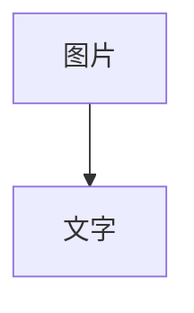
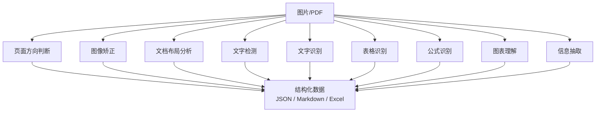
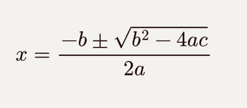
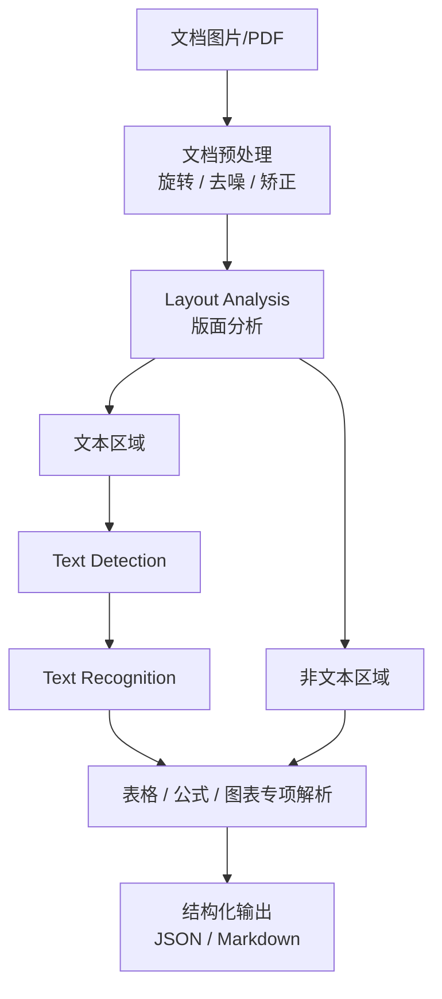
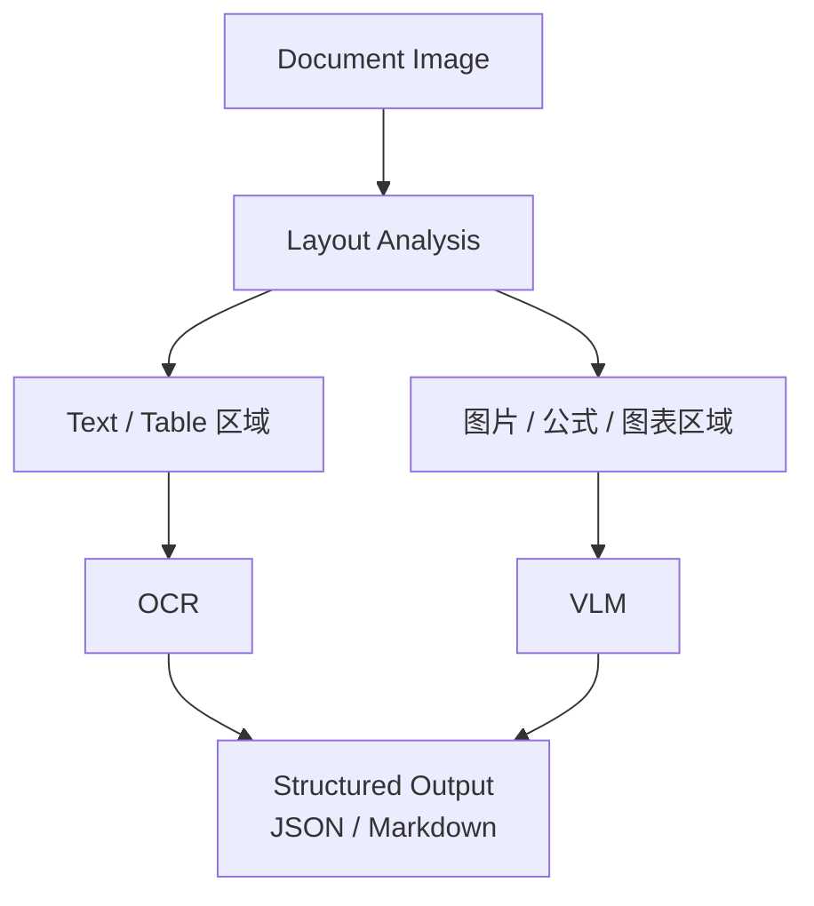
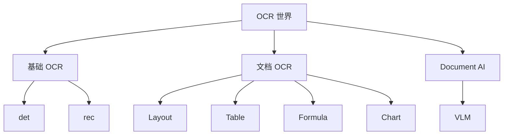

# week21_project_design

目前 我们所说的 OCR 领域现在已经不只是图片转文字了，它更像是一个完整的文档理解 pipline。

传统的 OCR 流程一般是：



现代 OCR：



## 1. 文档方向分类模型（Document Orientation Classification）
为什么要有一个文本方向分类模型？用户输入的扫描件很可能是正着、横着、倒着的。不一定每次文字都是正向排布，而文本方向分类模型需要判断图中的文字方向。  
例如：rotation = 90° 判断完后，再通过旋转将文字转正。  
代表模型：PP-LCNet_x1_0_doc_ori  

## 2. 文本检测模型（Text Detection）
这是 OCR 最核心的第一个模型。它找出图片中文字在哪里。也就是输入一张图，输出一些文字的区域。  
```text
[
 {
  box:[
   [10,20],
   [200,20],
   [200,60],
   [10,60]
  ]
 }
]
```
常见模型： PP-OCRv5_server_det、PP-OCRv5_mobile_det
mobile_det 顾名思义模型更小，以 mobilenet 为骨干网络来设计的。
而 server 版本是参数量更大的模型，一般跑在服务器上，推理速度较慢，但是准确率较高。

## 3. 文本识别模型（Text Recognition）
在检测到文本位置之后，我们还需要知道这个位置的文本内容是什么。  
裁剪出这部分图片，交给文本识别模型。文本识别模型会输出裁剪下来的图像中包含的文字内容。  
代表模型：PP-OCRv5_server_rec、PP-OCRv5_mobile_rec
它支持很多中语言：中文、英文、日文等多语言。 
检测模型决定文字找得准不准。识别模型决定字看得准不准。两个需要配合使用。  

## Document AI
## 1. 文档布局分析模型（Layout Detection）
这是进入 Document AI 的关键。  
如果只进行文本检测和识别，我们不知道哪部分是标题，哪部分是表格，哪里是段落，哪里是公式。  
在做文档分析的时候会很被动，无法形成结构化的结果。  
Layout 模型本质上也是一个检测模型，但它会输出大块的区域信息，比文本检测的细粒度更粗，但是它区分出了文本的性质。  
```text
[
 {
  type:"title",
  box:[]
 },

 {
  type:"table",
  box:[]
 },

 {
  type:"paragraph",
  box:[]
 }
]
```
代表模型：PP-DocLayoutV2  
它可以识别：标题、段落、图片、表格、公式、图表、页眉页脚等等。  

## 2. 表格识别模型（Table Recognition）
这是商业 OCR 很重要的一块。模型会把图片或 pdf 表格恢复成：  
```json
{
 "姓名":"张三",
 "年龄":20
}
```
一般应用于财报、发票、Excel截图、PDF表格等。  

## 3. 公式识别模型（Formula Recognition）
顾名思义，专门用来处理数学公式。  
假如有一张图片：  
  
模型输出 LaTeX 标准公式：  
```text
x=\frac{-b\pm\sqrt{b^2-4ac}}{2a}
```

## 4. 图表解析模型（Chart Parsing）
输入一些柱状图、折线图等等。  
模型输出：  
```json
[
 {
  "name":"xxx图例",
  "value":100
 }
]
```

## 5. 印章识别模型（Seal Recognition）

印章识别在国内场景非常重要。例如一些合同公章、企业印章等等。他的特点是文字区域一般是弧形排列。  

## 总结一下

文档结构化流程一般如下：



## VLM（视觉语言模型）
这是最新方向。例如：PaddleOCR-VL、GPT-4V、Qwen-VL、InternVL。  
它不像传统 OCR pipeline 那样结构复杂，串联多个模型。很暴力直接使用图片进行理解。输入图片和问题，直接输出答案。  
比如有一个增长曲线表格，可以直接问：2025收入比2023增长多少？  
传统 OCR 只能识别出文字，增长多少需要自己计算，VLM 会通过理解图片和问题的语义，直接回答增长xx%。  

有些 VLM 内部也不只有一个大模型比如，PaddleOCR-VL：  
它会通过使用传统 OCR 进行一个预处理，先提取一部分信息，再通过 VLM 理解。流程大概是这样：



这样既能减少整张图片直接塞进 VLM 后产生的大量视觉 token，也能更精准的让 VLM 理解关键信息。

整理一下：



## 应用场景  

1、什么时候用传统 ocr？  
场景：大批量身份证、票据、快速文字提取等。  
要求：快、准、便宜

2、什么时候用 VLM？  
场景：PDF理解、合同分析、年报分析、论文解析、企业知识库等。  
例如：上传一个100页年报.pdf  
问：找出所有关于净利润下降原因的章节。

## 基于 PaddleOCR 和 Qwen3-VL-8B-Instruct 的文档理解实战

## 1、安装

```shell
pip install -r week21_project_design/requirements.txt
```

## 2、文档结构化

```python
from paddleocr import PPStructureV3

input_file = "docs/notes/BLIP.pdf"
output_path = Path("week21_project_design/output")

pipeline = PPStructureV3(
    engine="transformers",
    lang="en",
    use_table_recognition=False,
    use_formula_recognition=False,
)

output = pipeline.predict(input=input_file)

markdown_list = []
markdown_images = []

for res in output:
    md_info = res.markdown
    markdown_list.append(md_info)
    markdown_images.append(md_info.get("markdown_images", {}))

markdown_texts = pipeline.concatenate_markdown_pages(markdown_list)
print(f"markdown result type={type(markdown_texts).__name__}")
if not isinstance(markdown_texts, str):
    markdown_texts = markdown_texts["markdown_texts"]
if not isinstance(markdown_texts, str):
    raise TypeError(f"Expected markdown text to be str, got {type(markdown_texts).__name__}")

mkd_file_path = output_path / f"{Path(input_file).stem}.md"
mkd_file_path.parent.mkdir(parents=True, exist_ok=True)

with open(mkd_file_path, "w", encoding="utf-8") as f:
    f.write(markdown_texts)

for item in markdown_images:
    if item:
        for path, image in item.items():
            file_path = output_path / path
            file_path.parent.mkdir(parents=True, exist_ok=True)
            image.save(file_path)

```
## 3、 VLM 文档理解

```python
import argparse
import re
from dataclasses import dataclass
from pathlib import Path
from urllib.parse import unquote

import torch
from transformers import AutoProcessor

try:
    from transformers import Qwen3VLForConditionalGeneration as Qwen3VLModel
except ImportError:
    from transformers import AutoModelForImageTextToText as Qwen3VLModel


ROOT = Path(__file__).resolve().parents[1]
DEFAULT_MODEL_PATH = ROOT / "models" / "Qwen3-VL-8B-Instruct"
DEFAULT_INPUT_PATH = ROOT / "docs" / "notes" / "BLIP.pdf"
DEFAULT_MARKDOWN_PATH = Path(__file__).resolve().parent / "output" / "BLIP.md"
DEFAULT_QUESTION = "根据这篇文章，总结文章创新点"

MARKDOWN_IMAGE_RE = re.compile(r"!\[[^\]]*\]\(([^)\s]+)(?:\s+['\"][^'\"]*['\"])?\)")
HTML_IMAGE_RE = re.compile(r"]+src=[\"']([^\"']+)[\"'][^>]*>", re.IGNORECASE)


@dataclass
class DocumentInput:
    text: str
    images: list[Path]


def resolve_image_path(raw_path: str, base_dir: Path) -> Path | None:
    raw_path = unquote(raw_path.strip().strip("<>"))
    if not raw_path or raw_path.startswith(("http://", "https://", "data:")):
        return None

    path = Path(raw_path)
    if not path.is_absolute():
        path = base_dir / path
    path = path.resolve()
    return path if path.exists() else None


def extract_markdown_images(text: str, base_dir: Path, max_images: int | None) -> list[Path]:
    image_paths = []
    seen = set()
    raw_paths = MARKDOWN_IMAGE_RE.findall(text) + HTML_IMAGE_RE.findall(text)

    for raw_path in raw_paths:
        image_path = resolve_image_path(raw_path, base_dir)
        if image_path is None or image_path in seen:
            continue
        seen.add(image_path)
        image_paths.append(image_path)
        if max_images is not None and len(image_paths) >= max_images:
            break

    return image_paths


def parse_markdown(
    path: Path,
    max_chars: int | None = None,
    max_images: int | None = None,
) -> DocumentInput:
    """Read markdown text and collect local images referenced by markdown/html tags."""
    text = path.read_text(encoding="utf-8")
    images = extract_markdown_images(text, path.parent, max_images)

    text = re.sub(r"<div[^>]*>.*?</div>", "\n", text, flags=re.DOTALL | re.IGNORECASE)
    text = re.sub(r"!\[[^\]]*\]\([^)]+\)", "\n", text)
    text = re.sub(r"]*>", "\n", text, flags=re.IGNORECASE)
    text = re.sub(r"\n{3,}", "\n\n", text).strip()
    if max_chars is not None and len(text) > max_chars:
        text = text[:max_chars]
    return DocumentInput(text=text, images=images)


def parse_pdf(path: Path, max_chars: int | None = None) -> DocumentInput:
    try:
        import pypdfium2 as pdfium
    except ImportError as exc:
        raise RuntimeError(
            "PDF input requires pypdfium2. Install it with: pip install pypdfium2"
        ) from exc

    pdf = pdfium.PdfDocument(path)
    pages = []
    for index in range(len(pdf)):
        page = pdf[index]
        textpage = page.get_textpage()
        pages.append(textpage.get_text_range())
        textpage.close()
        page.close()

    text = "\n\n".join(pages)
    text = re.sub(r"\n{3,}", "\n\n", text).strip()
    if max_chars is not None and len(text) > max_chars:
        text = text[:max_chars]
    return DocumentInput(text=text, images=[])


def parse_document(
    path: Path,
    max_chars: int | None = None,
    max_images: int | None = None,
) -> DocumentInput:
    suffix = path.suffix.lower()
    if suffix in {".md", ".markdown", ".txt"}:
        return parse_markdown(path, max_chars, max_images)
    if suffix == ".pdf":
        return parse_pdf(path, max_chars)
    raise ValueError(f"Unsupported input file type: {suffix}. Use markdown, txt, or pdf.")


def build_messages(document: DocumentInput, question: str) -> list[dict]:
    image_note = ""
    if document.images:
        image_note = f"\n\n文档中同时附带了 {len(document.images)} 张按原文顺序抽取的图片，请结合这些图片理解图表、模型结构和实验结果。"

    content = [
        {
            "type": "text",
            "text": (
                "你是一名多模态论文阅读助手。请只根据给定文章内容作答，"
                "优先提炼方法层面的创新点，并用中文分点总结。"
                f"{image_note}\n\n文章文本：\n{document.text}"
            ),
        }
    ]
    for image_path in document.images:
        content.append({"type": "image", "image": str(image_path)})
    content.append({"type": "text", "text": f"问题：{question}"})
    return [{"role": "user", "content": content}]


def parse_args() -> argparse.Namespace:
    parser = argparse.ArgumentParser(
        description="Use local Qwen3-VL-8B-Instruct to summarize innovations in a paper."
    )
    parser.add_argument("--model-path", type=Path, default=DEFAULT_MODEL_PATH)
    parser.add_argument(
        "--input",
        type=Path,
        default=DEFAULT_INPUT_PATH,
        help="Input paper file. Supports markdown, txt, and pdf.",
    )
    parser.add_argument(
        "--markdown",
        type=Path,
        default=None,
        help="Backward-compatible alias for --input.",
    )
    parser.add_argument("--question", default=DEFAULT_QUESTION)
    parser.add_argument("--max-new-tokens", type=int, default=768)
    parser.add_argument(
        "--max-input-chars",
        type=int,
        default=None,
        help="Optionally truncate the parsed document before inference.",
    )
    parser.add_argument(
        "--max-images",
        type=int,
        default=8,
        help="Maximum number of local images to include from markdown input. Use 0 to disable.",
    )
    parser.add_argument(
        "--device-map",
        default="auto",
        help='Passed to from_pretrained; use "cpu" to force CPU inference.',
    )
    return parser.parse_args()


def main() -> None:
    args = parse_args()
    model_path = args.model_path.resolve()
    input_path = (args.markdown or args.input).resolve()
    max_images = None if args.max_images < 0 else args.max_images

    document = parse_document(input_path, args.max_input_chars, max_images)
    messages = build_messages(document, args.question)

    processor = AutoProcessor.from_pretrained(model_path, trust_remote_code=True)
    model = Qwen3VLModel.from_pretrained(
        model_path,
        dtype="auto",
        device_map=args.device_map,
        trust_remote_code=True,
    )
    model.eval()

    inputs = processor.apply_chat_template(
        messages,
        tokenize=True,
        add_generation_prompt=True,
        return_dict=True,
        return_tensors="pt",
    )
    inputs = inputs.to(model.device)

    with torch.inference_mode():
        generated_ids = model.generate(
            **inputs,
            max_new_tokens=args.max_new_tokens,
            do_sample=False,
        )

    generated_ids_trimmed = [
        output_ids[len(input_ids) :]
        for input_ids, output_ids in zip(inputs.input_ids, generated_ids)
    ]
    output_text = processor.batch_decode(
        generated_ids_trimmed,
        skip_special_tokens=True,
        clean_up_tokenization_spaces=False,
    )
    print(output_text[0].strip())


if __name__ == "__main__":
    main()

```
## 对比结果
### 只传 pdf 时

模型输出结果比较抽象

```text
根据文章内容，BLIP 的方法层面创新点可总结为以下几点：

1. **提出多模态混合编码器-解码器（Multimodal Mixture of Encoder-Decoder, MED）架构**  
   - 该架构可灵活切换为三种模式：  
     （1）单模态编码器（用于图像-文本对比学习）；  
     （2）图像引导文本编码器（用于图像-文本匹配）；  
     （3）图像引导文本解码器（用于图像条件语言建模）。  
   - 通过共享参数（除自注意力层外）实现多任务联合预训练，提升效率并增强泛化能力。

2. **提出“生成+过滤”（Captioning and Filtering, CapFilt）数据自举方法**  
   - 利用预训练 MED 模型微调出两个模块：  
     - **Captioner**：生成图像的合成描述（合成文本）；  
     - **Filter**：通过 ITM 任务过滤掉噪声文本（包括原始网络文本和合成文本）。  
   - 通过“生成-过滤”循环提升数据质量，有效利用噪声网络数据，而非简单依赖人工标注数据。

3. **设计统一的预训练目标组合**  
   - 联合优化三个任务：  
     （1）图像-文本对比学习（ITC）；  
     （2）图像-文本匹配（ITM）；  
     （3）图像条件语言建模（LM）。  
   - 该组合支持理解型任务（如检索）和生成型任务（如图像描述），实现统一预训练框架。

4. **引入多样性驱动的合成文本生成策略**  
   - 使用 **Nucleus Sampling**（而非 Beam Search）生成合成描述，以提高文本多样性，避免生成“安全但无信息”的文本，从而提升模型学习效果。

5. **参数共享与解耦设计优化训练效率与性能**  
   - 文本编码器与解码器共享除自注意力层外的参数，减少模型规模并提升训练效率；  
   - 实验表明共享自注意力层会降低性能，因编码与解码任务存在冲突。

6. **支持零样本迁移至视频语言任务**  
   - 模型在图像语言任务上训练后，可直接零样本迁移至视频检索与视频问答任务，验证其强大的泛化能力。
```

### 文档结构化后
模型根据文档结构化后的 markdown 文本和图片，模型看了图之后输出更为具体：

```text
1.  **提出“多模态混合编码器-解码器”（MED）模型架构**：
    *   该架构设计为一个统一的模型，能够根据任务需求灵活切换为三种模式：**仅编码器模式**（用于图像和文本的独立编码）、**图像引导的文本编码器模式**（用于图像-文本对的联合表示学习）和**图像引导的文本解码器模式**（用于图像条件下的文本生成）。
    *   通过共享大部分参数（仅自注意力层不同），该架构实现了高效的多任务联合预训练，同时兼顾了理解型任务（如检索）和生成型任务（如图像描述）的需求，解决了现有模型在单一架构上难以同时精通两类任务的局限。

2.  **提出“生成与过滤”（CapFilt）数据自举方法**：
    *   该方法旨在有效利用海量但噪声严重的网络图像-文本对。其核心思想是：**先用一个预训练好的 MED 模型作为“生成器”（Captioner），为网络图像生成合成描述（Ts）；再用同一个模型作为“过滤器”（Filter），根据图像-文本匹配度（ITM）来筛选并剔除噪声文本（包括原始网络文本 Tw 和合成文本 Ts）**。
    *   通过这种“生成-过滤”的协同机制，CapFilt 能够构建一个更高质量、更丰富的训练数据集，从而显著提升下游任务性能。实验表明，生成的合成文本多样性越高，效果越好。

3.  **引入“图像引导的文本解码器”作为生成任务的核心组件**：
    *   与传统的掩码语言建模（MLM）不同，BLIP 在生成任务中采用**图像引导的文本解码器**，其核心是使用**因果自注意力**机制，以图像特征为条件，自回归地生成连贯的文本描述。
    *   这种设计使得模型在图像描述等生成任务上具备更强的泛化能力，能够将视觉信息有效转化为自然语言。

4.  **在预训练中联合优化三种任务目标**：
    *   BLIP 在预训练阶段同时优化三个目标：**图像-文本对比学习（ITC）**、**图像-文本匹配（ITM）** 和**图像条件语言建模（LM）**。
    *   这种多任务联合学习策略，使得模型能够从不同角度学习视觉与语言的对齐关系，从而在理解与生成任务上都取得优异表现。

5.  **在模型架构中引入“图像引导的文本编码器”**：
    *   该编码器在标准文本编码器的基础上，插入了**跨注意力层**，使其能够将图像特征注入到文本编码过程中，从而学习到更细粒度的视觉-语言对齐表示，这对于图像-文本检索等理解任务至关重要。

6.  **在数据处理中引入“核采样”（Nucleus Sampling）生成合成文本**：
    *   为了提高合成文本的多样性，CapFilt 使用核采样（Nucleus Sampling）而非确定性的束搜索（Beam Search）来生成合成描述。
    *   实验表明，尽管核采样生成的文本可能更“嘈杂”，但其带来的多样性能为模型提供更丰富的信息，从而在下游任务中取得更好的性能。

```