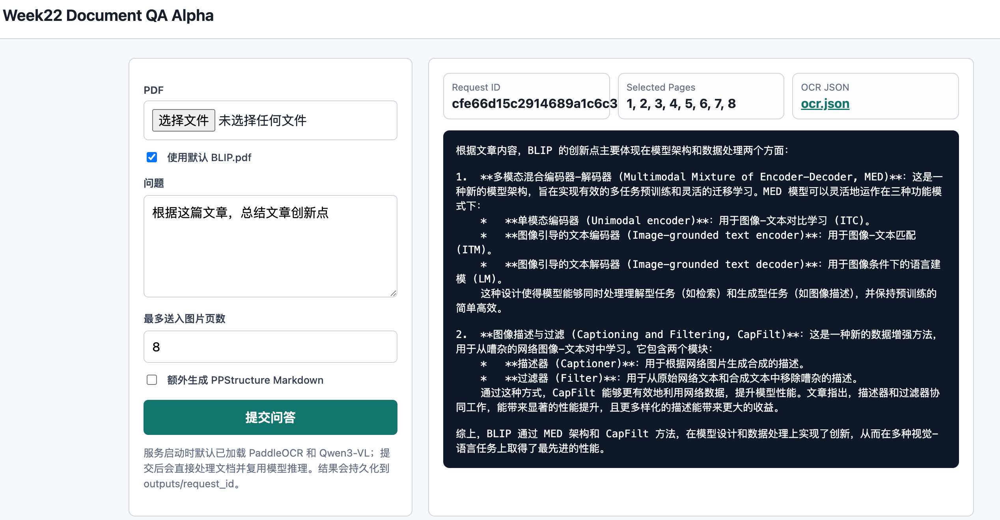

# week22_project_core_impl



实现：上传 PDF，拆成页面图片，对每页做基础 OCR 并保存结构化 JSON，再把全文 OCR 文本和最多前/相关 8 页图片送入本地 Qwen3-VL 做问答。

## 功能

- PDF -> PNG 页面序列，默认使用 PyMuPDF。
- 基础 OCR JSON：文本、位置框、置信度、页码、页面尺寸。
- 可选 PPStructure Markdown：通过 `enable_ppstructure=true` 开启。
- Qwen3-VL 问答：FastAPI 启动时默认预加载本地模型，上传文档后直接复用同一个 Qwen3-VL 实例推理。
- 最小前端：`GET /` 上传 PDF、输入问题、展示答案。
- 默认持久化：`week22_project_core_impl/outputs/{request_id}`。

## 启动

默认启动会初始化并加载 PaddleOCR 和 Qwen3-VL 模型；生产建议保持 `--workers 1`，避免多个 worker 重复占用 GPU。只做接口调试时，可临时设置 `DOC_QA_PRELOAD_OCR=false DOC_QA_PRELOAD_VLM=false`。

```shell
conda run -n doc_parser uvicorn week22_project_core_impl.service.app:app \
  --host 0.0.0.0 \
  --port 9100 \
  --workers 1
```

浏览器打开：

```text
http://127.0.0.1:9100/
```

## CLI 调用

使用默认 `docs/notes/BLIP.pdf`：

```shell
conda run -n doc_parser python -m week22_project_core_impl.scripts.client \
  --url http://127.0.0.1:9100/api/ask \
  --use-default-pdf \
  --question "根据这篇文章，总结文章创新点"
```

直接跑本地 pipeline：

```shell
conda run -n doc_parser python -m week22_project_core_impl.scripts.run_pipeline \
  --pdf docs/notes/BLIP.pdf \
  --question "根据这篇文章，总结文章创新点"
```

只做 PDF 拆页和 OCR，不加载 Qwen3-VL：

```shell
conda run -n doc_parser python -m week22_project_core_impl.scripts.run_pipeline \
  --pdf docs/notes/BLIP.pdf \
  --parse-only
```

## Smoke Test

默认只验证拆页和 OCR：

```shell
conda run -n doc_parser python -m week22_project_core_impl.scripts.smoke_test
```

包含 Qwen3-VL 生成：

```shell
conda run -n doc_parser python -m week22_project_core_impl.scripts.smoke_test \
  --run-vlm \
  --max-images 2 \
  --max-new-tokens 128
```

## 配置

- `DOC_QA_MODEL_PATH`：默认 `models/Qwen3-VL-8B-Instruct`
- `DOC_QA_DEFAULT_PDF`：默认 `docs/notes/BLIP.pdf`
- `DOC_QA_OUTPUT_DIR`：默认 `week22_project_core_impl/outputs`
- `DOC_QA_DPI`：PDF 渲染 DPI，默认 `180`
- `DOC_QA_OCR_LANG`：OCR 语言，默认 `ch`，用于中英混合
- `DOC_QA_MAX_PAGES`：最多处理页数，默认 `0` 表示全部
- `DOC_QA_MAX_IMAGES`：最多送入 VLM 的页面图片数，默认 `8`
- `DOC_QA_MAX_INPUT_CHARS`：送入 VLM 的 OCR 文本上限，默认 `24000`
- `DOC_QA_ENABLE_PPSTRUCTURE`：默认 `false`
- `DOC_QA_PRELOAD_VLM`：默认 `true`，FastAPI 启动时预加载 Qwen3-VL
- `DOC_QA_MAX_CONCURRENCY`：默认 `1`

