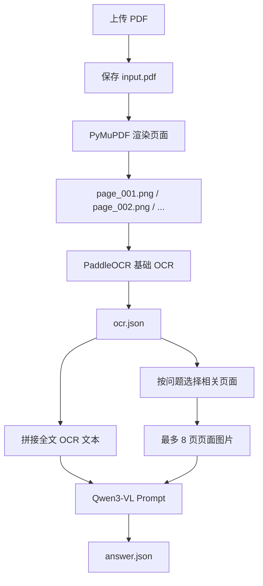

# week22_project_core_impl

week21 主要是在梳理 OCR、Document AI 和 VLM 文档理解的整体思路。week22 开始把这个思路落成一个可运行的最小项目：上传一份 PDF，先把 PDF 拆成页面图片，再对每页做基础 OCR，保存结构化 JSON，最后把 OCR 全文和部分页面图片一起交给本地 Qwen3-VL 做问答。

这个项目采用“传统 OCR + VLM”的混合方案，没有直接让 VLM 盲看整份 PDF。OCR 负责把文档中的文字稳定抽出来，VLM 负责结合问题、OCR 文本和页面图像做语义理解。这样可以减少视觉 token 压力，也方便把中间结果保存下来用于调试、复查和后续扩展。

## 项目目标

本周实现的是一个文档问答 alpha 版本，核心目标有三个：

1. 能把 PDF 变成可处理的页面图片。
2. 能把每页 OCR 结果保存成结构化数据。
3. 能基于 OCR 文本和页面图片调用 Qwen3-VL 回答问题。

完整流程如下：



输出默认保存在：

```text
week22_project_core_impl/outputs/{request_id}
```

每次请求会形成一个独立目录，里面包含原始 PDF、页面图片、OCR JSON、artifacts 和最终答案。这样做的好处是一次请求的所有中间产物都可以追踪，后面发现回答不准时，可以先判断问题出在 PDF 渲染、OCR 识别、页面选择，还是 VLM 生成。

## 目录结构

```text
week22_project_core_impl/
├── core/
│   ├── config.py              # 环境变量和运行参数
│   ├── document_store.py      # request_id 目录和输入 PDF 持久化
│   ├── pdf_splitter.py        # PDF 拆成页面 PNG
│   ├── ocr_engine.py          # PaddleOCR 和 PPStructure
│   ├── vlm_engine.py          # Qwen3-VL 文档问答
│   ├── pipeline.py            # 串联 parse_pdf / ask
│   └── schemas.py             # PageImage / OCRPage / DocumentArtifacts
├── service/
│   └── app.py                 # FastAPI 服务
├── scripts/
│   ├── client.py              # 调用 HTTP 服务
│   ├── run_pipeline.py        # 本地直接跑 pipeline
│   └── smoke_test.py          # 冒烟测试
├── frontend/
│   └── index.html             # 最小上传问答页面
├── README.md
└── requirements.txt
```

这次实现把逻辑拆成 `core` 和 `service` 两层，FastAPI 里只保留服务入口相关代码。`core` 可以被 CLI、测试脚本和服务复用；`service` 只负责 HTTP 上传、参数校验、并发队列和响应返回。

## 核心数据结构

`schemas.py` 里定义了几个中间对象：

- `PageImage`：一页 PDF 渲染后的图片路径、页码、宽高。
- `OCRBlock`：一个文本块，包含文字、位置框、置信度和页码。
- `OCRPage`：一页的 OCR 结果，包含页面图片和所有文本块。
- `DocumentArtifacts`：一次文档解析的完整产物，包含 request_id、工作目录、输入 PDF、页面图片、OCR JSON 和可选 Markdown。

其中 `DocumentArtifacts.full_text` 会把每页 OCR 文本拼成：

```text
[Page 1]
...

[Page 2]
...
```

这个格式很简单，但对问答很有用。模型回答时可以知道文本来自哪一页，后续如果要让答案带引用页码，也可以基于这个结构继续扩展。

## PDF 拆页

PDF 不能直接交给基础 OCR，所以第一步是用 PyMuPDF 渲染成 PNG：

```python
zoom = dpi / 72.0
matrix = fitz.Matrix(zoom, zoom)
pix = page.get_pixmap(matrix=matrix, alpha=False)
pix.save(str(image_path))
```

这里的 `DOC_QA_DPI` 默认是 `180`。DPI 太低会影响 OCR，特别是论文、表格和小字号文本；DPI 太高会让图片变大，OCR 和 VLM 都会更慢。180 是一个偏实用的折中值。

拆页后会得到：

```text
pages/page_001.png
pages/page_002.png
pages/page_003.png
...
```

如果只想快速调试，可以设置：

```shell
DOC_QA_MAX_PAGES=3
```

这样只处理前几页，避免每次调试都跑完整 PDF。

## 基础 OCR

OCR 部分使用 PaddleOCR，默认配置是：

```python
PaddleOCR(
    lang=lang,
    ocr_version="PP-OCRv5",
    use_doc_orientation_classify=False,
    use_doc_unwarping=False,
    use_textline_orientation=False,
    device=device,
)
```

这里先关闭了方向分类、文档矫正和文本行方向识别，原因是当前项目优先验证完整链路。如果输入主要是正常论文 PDF，页面方向一般是正的，先把基础 OCR 跑通更重要。后面要支持扫描件、拍照文档、旋转页面时，可以再打开这些预处理能力。

OCR 输出会保存到 `ocr.json`：

```json
{
  "pages": [
    {
      "page_number": 1,
      "image_path": ".../pages/page_001.png",
      "width": 1488,
      "height": 2105,
      "text": "...",
      "blocks": [
        {
          "page_number": 1,
          "text": "BLIP: Bootstrapping Language-Image Pre-training",
          "box": [[...], [...], [...], [...]],
          "score": 0.98
        }
      ]
    }
  ]
}
```

保存 `box` 和 `score` 的意义在于：现在问答只用了纯文本和页面图片，但后续如果要做高亮、引用定位、版面分析或结果可视化，位置框和置信度都是必要信息。

## PPStructure Markdown

项目里还保留了可选的 PPStructure 路径：

```shell
DOC_QA_ENABLE_PPSTRUCTURE=true
```

或者 CLI 加：

```shell
--enable-ppstructure
```

PPStructure 会尝试输出 Markdown，更接近文档结构化结果，例如标题、段落、图片区域等。但是这条链路比基础 OCR 更重，而且表格、公式等模块也可能带来额外依赖和耗时，所以默认没有开启。

当前实现中：

```python
PPStructureV3(
    engine="transformers",
    lang=lang,
    use_table_recognition=False,
    use_formula_recognition=False,
)
```

也就是说，week22 先把结构化 Markdown 作为增强项。主链路仍然保持为基础 OCR JSON + 页面图片 + VLM。

## 页面选择

Qwen3-VL 不能无限制接收整份文档的所有页面图片。项目中默认最多送入 8 页图片：

```text
DOC_QA_MAX_IMAGES=8
```

页面选择逻辑在 `vlm_engine.py`：

```python
score = sum(1 for keyword in keywords if keyword in page.text.lower())
```

它会从问题中抽取关键词，然后按关键词和每页 OCR 文本的重合度排序。如果没有足够的相关页面，就用前面的页面补齐。

这个策略很简单，但在 alpha 版本里有两个好处：

- 不依赖向量数据库，部署和调试都更轻。
- 可以快速验证“先 OCR 检索页面，再交给 VLM 理解”的项目思路。

它的缺点也明显：同义词、跨语言表达、复杂语义问题召回能力有限。后续可以把这里替换成 embedding 检索、BM25、reranker 或者章节级检索。

## VLM Prompt 设计

传给 Qwen3-VL 的内容包含三部分：

1. OCR 全文文本。
2. 被选中的页面图片。
3. 用户问题。

系统提示大意是：

```text
你是一名文档问答助手。请只根据 OCR 文本和页面图片回答问题；
如果文档里没有依据，请说明未在文档中找到明确依据。
```

这里强调“只根据文档回答”，是为了减少模型凭常识补答案。文档问答更看重答案能否回到文档证据上，单纯让模型生成一段流畅文本并不够。

为了避免 prompt 过长，OCR 文本还会按字符数截断：

```text
DOC_QA_MAX_INPUT_CHARS=24000
```

如果超过限制，会在文本末尾追加“文本已截断”的提示。这个参数需要根据显存、模型上下文长度和文档规模调整。

## FastAPI 服务

服务入口是：

```shell
conda run -n doc_parser uvicorn week22_project_core_impl.service.app:app \
  --host 0.0.0.0 \
  --port 9100 \
  --workers 1
```

接口主要有三个：

| 接口 | 作用 |
| --- | --- |
| `GET /` | 打开最小前端 |
| `GET /health` | 查看模型路径、输出目录、模型是否加载 |
| `POST /api/parse` | 只解析 PDF，返回 OCR 和页面产物 |
| `POST /api/ask` | 上传 PDF 或使用默认 PDF，然后问答 |

服务启动时默认预加载 OCR 和 VLM：

```text
DOC_QA_PRELOAD_OCR=true
DOC_QA_PRELOAD_VLM=true
```

这会让第一次请求更快，但启动时间更长。如果只是调接口格式，可以临时关闭：

```shell
DOC_QA_PRELOAD_OCR=false DOC_QA_PRELOAD_VLM=false \
conda run -n doc_parser uvicorn week22_project_core_impl.service.app:app \
  --host 0.0.0.0 \
  --port 9100 \
  --workers 1
```

生产或真实 GPU 环境建议 `--workers 1`。因为每个 worker 都会各自加载一份 PaddleOCR 和 Qwen3-VL，多 worker 很容易重复占用显存。

## 并发控制

`service/app.py` 里实现了一个很小的请求队列：

```python
self._semaphore = asyncio.Semaphore(max(1, max_concurrency))
```

默认：

```text
DOC_QA_MAX_CONCURRENCY=1
DOC_QA_QUEUE_TIMEOUT_S=30
```

OCR 和 VLM 都是重任务，尤其在单卡本地服务里，并发开太大不一定会更快，反而可能导致显存峰值、排队时间和失败率上升。这里先用信号量限制并发，把请求串行或小并发执行，保证服务行为可控。

## 本地调试路径

如果不想启动 FastAPI，可以直接跑 pipeline：

```shell
conda run -n doc_parser python -m week22_project_core_impl.scripts.run_pipeline \
  --pdf docs/notes/BLIP.pdf \
  --question "根据这篇文章，总结文章创新点"
```

只验证 PDF 拆页和 OCR：

```shell
conda run -n doc_parser python -m week22_project_core_impl.scripts.run_pipeline \
  --pdf docs/notes/BLIP.pdf \
  --parse-only
```

这条路径适合排查 OCR、文件路径和输出结构，不需要考虑 HTTP 上传和前端。

启动服务后，也可以用 client 脚本走 HTTP：

```shell
conda run -n doc_parser python -m week22_project_core_impl.scripts.client \
  --url http://127.0.0.1:9100/api/ask \
  --use-default-pdf \
  --question "根据这篇文章，总结文章创新点"
```

这条路径更接近真实使用方式，可以验证 FastAPI、上传参数和返回 JSON。

## 一次请求的输出

一次完整问答会生成类似：

```text
outputs/{request_id}/
├── input.pdf
├── pages/
│   ├── page_001.png
│   ├── page_002.png
│   └── ...
├── ppstructure/
├── ocr.json
├── artifacts.json
└── answer.json
```

其中：

- `input.pdf`：本次请求实际处理的 PDF。
- `pages/`：PyMuPDF 渲染出来的页面图片。
- `ocr.json`：基础 OCR 结果。
- `artifacts.json`：本次 pipeline 产物索引。
- `answer.json`：问题、答案、被选中的页面和 artifacts。

调试文档问答时建议按这个顺序看：

1. 页面图片是否清晰。
2. `ocr.json` 是否识别到关键内容。
3. `answer.json` 里的 `selected_pages` 是否选中了正确页面。
4. 如果前三步都正常，再判断 VLM 的回答质量。

## 当前方案的边界

这个 alpha 版本已经能跑通文档问答，但还有一些明显边界：

- 页面选择基于关键词重合，还没有引入语义检索。
- OCR 全文是简单拼接，没有按标题、章节、表格结构组织。
- 默认只送最多 8 页图片，长文档的问题可能需要更强的检索策略。
- 表格和公式没有作为主链路解析。
- 答案还没有强制输出引用页码和证据片段。
- 上传文件只做了基础 PDF 校验，没有更完整的文件安全扫描。

这些边界来自当前项目阶段的取舍。week22 的重点是先把端到端链路做出来：PDF 进入系统后，能留下可复查的结构化中间结果，并能被本地 VLM 消费。

## 后续可以扩展的方向

比较自然的增强方向：

1. 把页面选择从关键词匹配升级成 embedding 检索。
2. 对 OCR 文本做 chunk，保存页码、块坐标和标题层级。
3. 让回答输出引用页码，例如 `[Page 3]`。
4. 把 `ocr.json` 的 box 用在前端，高亮答案依据。
5. 对表格页开启表格识别，或者把表格区域单独送入 VLM。
6. 增加缓存：同一个 PDF 不重复 OCR。
7. 增加异步任务队列，把长文档处理从 HTTP 请求中拆出去。

整体来看，week22 是把 week21 的“文档 OCR + VLM 理解”设计落成工程骨架。现在的实现已经具备可运行、可调试、可扩展三个基础条件，后面再往检索、引用、结构化和前端可视化方向扩展会比较顺。
