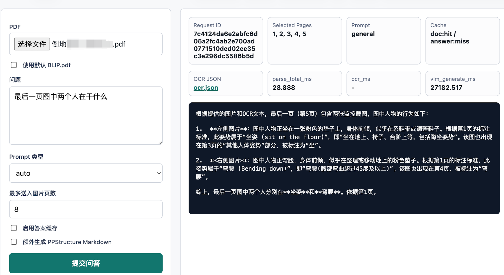
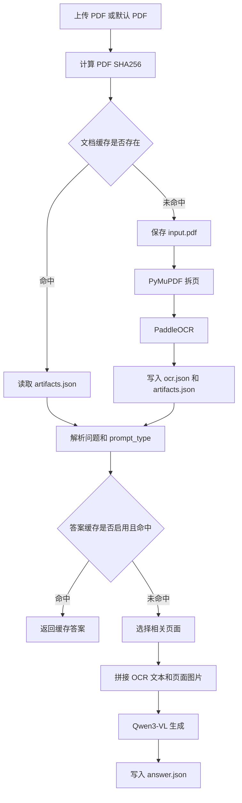

# week23_project_optimize



week22 已经把 PDF 文档问答的 alpha 链路跑通：PDF 拆页、PaddleOCR 基础识别、保存 OCR JSON，再把 OCR 文本和相关页面图片送给本地 Qwen3-VL 生成答案。week23 在这个基础上做 Beta 优化，重点从“能跑”推进到“可复用、可观察、可调试、可压测”。

这一周的主链路没有大改，仍然围绕 OCR + VLM 的混合文档理解方案展开。优化集中在工程层：重复文档走缓存，关键步骤记录耗时，prompt 根据问题类型调整，接口错误结构统一，最后用脚本做简单并发压测。

## 优化目标

week23 主要解决 week22 暴露出来的几个实际问题：

1. 同一份 PDF 每次提问都重新拆页和 OCR，耗时浪费明显。
2. 生成耗时不透明，不知道慢在 hash、拆页、OCR、缓存读取还是 VLM。
3. 所有问题共用一个 prompt，表格、标题定位、总结类问题的约束不够细。
4. 服务返回的错误结构不统一，前端和脚本不好判断失败阶段。
5. 缺少轻量压测工具，优化前后没有简单的对比方式。

所以 week23 可以看成是文档问答系统的 Beta 版。它离最终产品形态还有距离，但已经开始补齐上线前常见的工程能力。

## 整体流程

优化后的流程大概是：



这里有两层缓存：

- 文档缓存：按 PDF 内容 hash 缓存拆页、OCR 和 artifacts。
- 答案缓存：按文档 hash、问题、prompt、生成参数等缓存最终答案。

文档缓存默认开启，答案缓存默认关闭。这个默认值比较合理，因为 OCR 结果通常是确定的，答案生成会受 prompt、temperature、max token 等参数影响，默认每次生成更符合调试预期。

## 新增目录和模块

相比 week22，week23 多了几个优化相关模块：

```text
week23_project_optimize/
├── core/
│   ├── cache.py              # 文档缓存和答案缓存
│   ├── hashing.py            # PDF hash 和稳定 JSON hash
│   ├── timings.py            # 分阶段耗时记录
│   ├── prompt_templates.py   # prompt 类型和自动推断
│   ├── pipeline.py           # 接入缓存、timings 和答案缓存
│   └── vlm_engine.py         # 接入 prompt_type 和页码提示
├── service/
│   ├── app.py                # FastAPI Beta 服务
│   ├── errors.py             # 统一错误结构
│   └── logging_config.py     # 日志配置
├── scripts/
│   ├── benchmark.py          # 简单并发压测
│   ├── client.py
│   ├── run_pipeline.py
│   └── smoke_test.py
└── tests/
    ├── test_hashing.py
    ├── test_page_selector.py
    └── test_prompt_templates.py
```

这些改动的方向比较清晰：核心 pipeline 负责业务链路，service 负责接口和运行时保护，scripts 负责手工验证和压测，tests 覆盖不用加载大模型的纯逻辑。

## 文档缓存

文档缓存使用 PDF 文件内容的 SHA256：

```python
def file_sha256(path: Path, chunk_size: int = 1024 * 1024) -> str:
    digest = hashlib.sha256()
    with path.open("rb") as f:
        while chunk := f.read(chunk_size):
            digest.update(chunk)
    return digest.hexdigest()
```

缓存目录默认是：

```text
week23_project_optimize/cache/{document_hash}
```

命中缓存时，pipeline 会直接读取：

```text
artifacts.json
ocr.json
pages/page_001.png
...
```

这样重复文档可以跳过 `split_pdf_ms` 和 `ocr_ms` 两个重步骤。对文档问答服务来说，这个优化非常关键，因为同一份论文或合同通常会被连续问多个问题。第一次请求承担解析成本，后续问题可以直接复用中间产物。

当前文档缓存的判断条件很直接：`artifacts.json` 存在就认为命中。这个设计实现简单，也方便调试。后续如果要更严格，可以把 DPI、OCR 语言、max_pages、OCR 版本等参数也写入 artifacts，并在读取缓存时校验。

## 答案缓存

答案缓存的 key 由稳定 JSON hash 生成：

```python
{
    "document_hash": document_hash,
    "question": question,
    "max_images": effective_max_images,
    "max_input_chars": settings.max_input_chars,
    "max_new_tokens": effective_max_new_tokens,
    "temperature": settings.temperature,
    "prompt_type": effective_prompt_type,
}
```

保存路径类似：

```text
cache/{document_hash}/answers/{answer_cache_key}.json
```

答案缓存默认关闭：

```text
DOC_QA_ENABLE_ANSWER_CACHE=false
```

可以通过接口参数或命令行打开：

```shell
--use-answer-cache
```

它适合两类场景：

1. demo 时反复问同一个问题，希望响应尽量快。
2. temperature 为 0、prompt 和生成参数固定时，希望复用确定性答案。

如果频繁调整 prompt、max token、temperature，答案缓存 key 会变化。这个行为是符合预期的，因为这些参数都会影响最终回答。

## Timings

week23 加了一个很小的 `TimingRecorder`：

```python
@dataclass
class TimingRecorder:
    timings: dict[str, float] = field(default_factory=dict)

    @contextmanager
    def track(self, name: str):
        start = time.perf_counter()
        try:
            yield
        finally:
            self.timings[name] = round((time.perf_counter() - start) * 1000, 3)
```

pipeline 里会记录这些阶段：

| 字段 | 含义 |
| --- | --- |
| `hash_ms` | 计算 PDF SHA256 的耗时 |
| `load_cache_ms` | 从 artifacts 恢复文档产物的耗时 |
| `copy_input_ms` | 保存 input.pdf 的耗时 |
| `split_pdf_ms` | PDF 渲染为页面图片的耗时 |
| `ocr_ms` | 基础 OCR 耗时 |
| `ppstructure_ms` | 可选 PPStructure Markdown 耗时 |
| `parse_total_ms` | parse_pdf 整体耗时 |
| `answer_cache_lookup_ms` | 查询答案缓存耗时 |
| `vlm_generate_ms` | Qwen3-VL 生成耗时 |

这些字段会出现在 `/api/parse` 和 `/api/ask` 的返回 JSON 里，也会写入日志。排查性能问题时，不用先上复杂监控，直接看返回里的 `timings` 就能知道当前请求主要慢在哪。

例如同一份文档第二次请求，如果 `document_cache_hit=true`，理论上应该主要只剩 `load_cache_ms` 和 `vlm_generate_ms`。如果 `load_cache_ms` 也很高，就要检查缓存目录、文件系统或者 artifacts 体积。

## Prompt 优化

week22 使用一套通用提示词。week23 增加了 prompt 类型：

```text
auto / general / table / heading / summary
```

默认是 `auto`，会根据问题关键词推断：

- 问题包含“表、表格、数字、金额、占比、增长、下降”等，走 `table`。
- 问题包含“标题、章节、目录、小节”等，走 `heading`。
- 问题包含“总结、概括、归纳、创新点、摘要”等，走 `summary`。
- 其他问题走 `general`。

不同 prompt 会强化不同约束。比如 `table` 会要求优先检查数字、单位、列名、行名，并在涉及计算时写出简要过程；`summary` 会要求按要点输出；`heading` 会优先关注章节编号和目录信息。

VLM 输入里还增加了页面提示：

```text
已附带页面图片页码：1, 2, 3。
OCR 文本按 [Page n] 标记页码，请回答时引用这些页码。
```

这个改动很实用。文档问答的答案需要能追溯到页码，尤其是论文、合同、财报这类场景。当前实现是 prompt 约束，后续还可以做成更严格的输出格式，例如要求模型返回 JSON：答案、依据页码、证据片段。

## 页面选择仍然保持轻量

页面选择逻辑沿用关键词重合：

```python
score = sum(1 for keyword in keywords if keyword in text)
```

这个方案部署成本低，不依赖向量库，适合 Beta 阶段做快速验证。它的主要短板是语义召回能力有限，比如同义词、英文缩写、跨页线索和复杂推理问题，关键词匹配不一定能选中最相关页面。

后续优化可以替换为：

1. BM25 页面召回。
2. embedding 检索 chunk。
3. reranker 重排。
4. 先按章节粗召回，再按页面细召回。

不过在引入这些组件前，保留一个简单、可解释的 baseline 很有价值。至少当模型答错时，可以先看 `selected_pages` 是否合理。

## API 和错误结构

服务端口从 week22 的 `9100` 改到 `9200`：

```shell
conda run -n doc_parser uvicorn week23_project_optimize.service.app:app \
  --host 0.0.0.0 \
  --port 9200 \
  --workers 1
```

`/api/ask` 返回中新增了几个字段：

```json
{
  "document_hash": "...",
  "document_cache_hit": true,
  "answer_cache_hit": false,
  "prompt_type": "summary",
  "selected_pages": [1, 2],
  "timings": {
    "hash_ms": 2.1,
    "load_cache_ms": 8.4,
    "vlm_generate_ms": 5320.6
  }
}
```

错误返回也统一成：

```json
{
  "error": {
    "code": "BAD_REQUEST",
    "message": "question is required",
    "request_id": null,
    "stage": "validate"
  }
}
```

`stage` 很重要。前端或脚本看到错误后，可以区分是上传阶段、排队阶段、加载默认 PDF、下载 artifact，还是参数校验失败。

## 日志

日志默认写到：

```text
week23_project_optimize/logs/app.log
```

服务启动时会记录 OCR 和 VLM 预加载，接口调用时会记录：

- request_id / document_hash
- document_cache_hit
- answer_cache_hit
- prompt_type
- selected_pages
- timings

这类日志对本地调试很够用。比如看到接口响应慢，可以先查同一条请求的 `timings`，再对照日志确认是否命中缓存、选了哪些页面、生成阶段是否占主要耗时。

## OCR workers

week23 接入了：

```text
DOC_QA_OCR_WORKERS
```

默认值仍然是 `1`。这里保持保守是有必要的。PaddleOCR 加载成本高，GPU 上并发 worker 可能会带来额外显存占用和稳定性问题。比较稳的做法是先用单 worker 建立基线，再在固定文档和固定机器上尝试：

```shell
DOC_QA_OCR_WORKERS=2
```

然后看 `ocr_ms` 是否真的下降，以及服务是否出现显存峰值、超时或失败率上升。

## 测试

week23 加了不依赖 OCR 和 Qwen3-VL 的单元测试：

```shell
conda run -n doc_parser env PYTHONPATH=. pytest week23_project_optimize/tests
```

测试覆盖重点是纯逻辑：

- `test_hashing.py`：文件 hash 和稳定 JSON hash。
- `test_prompt_templates.py`：prompt 类型推断和兜底。
- `test_page_selector.py`：关键词页面选择。

这些测试跑得快，也不会加载大模型。项目里涉及大模型的部分很难在普通 CI 中完整跑，所以要优先把纯函数和轻量逻辑测住。

## Smoke Test

默认 smoke test 验证文档缓存：

```shell
conda run -n doc_parser env DOC_QA_MAX_PAGES=1 python -m week23_project_optimize.scripts.smoke_test
```

它的核心预期是：第一次 parse 可能 cache miss，第二次同文档必须 cache hit。这个测试很适合验证缓存目录、hash、artifacts 反序列化是否正常。

如果要包含 Qwen3-VL 生成：

```shell
conda run -n doc_parser python -m week23_project_optimize.scripts.smoke_test \
  --run-vlm \
  --max-images 2 \
  --max-new-tokens 128
```

这条会加载本地模型，耗时和显存要求都高一些，更适合在真实 GPU 环境里手动跑。

## Benchmark

压测脚本默认测并发 `1/2/4`，每档 `5` 次：

```shell
conda run -n doc_parser python -m week23_project_optimize.scripts.benchmark \
  --url http://127.0.0.1:9200/api/ask \
  --use-default-pdf \
  --max-images 2 \
  --max-new-tokens 128
```

输出会包含：

- success / success_rate
- avg_ms
- p50_ms / p90_ms / p95_ms
- statuses
- document_cache_hits
- answer_cache_hits

如果只想测试缓存命中路径：

```shell
--use-answer-cache
```

压测时要注意，当前服务默认 `DOC_QA_MAX_CONCURRENCY=1`，所以并发请求会排队。这个设置更偏稳定性验证。想测更高并发，需要同时调整服务并发、OCR worker、max_images、max_new_tokens，并观察 GPU 显存和失败率。

## 调试建议

文档问答效果不好时，可以按这个顺序排查：

1. 看 `document_cache_hit`，确认当前请求是否复用了旧 OCR。
2. 看 `timings`，判断慢在 OCR 还是 VLM 生成。
3. 看 `selected_pages`，确认相关页有没有被送入 VLM。
4. 打开 `cache/{document_hash}/ocr.json`，确认关键文字是否被 OCR 识别出来。
5. 调整 `prompt_type`，例如总结类问题直接试 `summary`，表格数字类问题试 `table`。
6. 降低 `max_images` 和 `max_new_tokens`，确认性能变化。

如果 OCR 中已经没有关键内容，VLM 很难稳定答对。这个时候要回到 PDF 渲染 DPI、OCR 语言、PPStructure 或表格识别方向优化。

## 当前边界

Beta 版本已经补了不少工程能力，但仍有几个边界：

- 页面召回还是关键词匹配，复杂语义问题需要更强检索。
- 文档缓存只按 PDF hash 判断，暂未校验 OCR 配置和 DPI。
- 答案引用页码主要靠 prompt 约束，没有强制结构化校验。
- 答案缓存适合确定性生成，不适合频繁调 prompt 的实验阶段。
- OCR worker 默认单并发，多 worker 需要按机器资源验证。
- 长文档仍然受 `DOC_QA_MAX_INPUT_CHARS` 和 `DOC_QA_MAX_IMAGES` 限制。

## 后续方向

week23 之后比较自然的优化路线：

1. 给 OCR 文本做 chunk，并保存页码、box、标题层级。
2. 引入 embedding 或 BM25，把页面选择升级成检索模块。
3. 输出结构化答案，包含 answer、pages、evidence。
4. 在前端展示页码依据，并根据 OCR box 高亮证据文本。
5. 缓存校验加入 DPI、OCR 语言、OCR 版本和 max_pages。
6. 把长任务拆成异步队列，HTTP 只负责提交任务和查询状态。
7. 用更系统的 benchmark 对比缓存命中、不同 max_images、不同 max_new_tokens 的性能。

整体来看，week23 的重点在工程打磨：把 week22 的端到端 demo 推进成更接近真实服务的 Beta 版本。缓存让重复请求更快，timings 让慢点可见，prompt 类型让回答更贴近场景，测试和压测让后续优化有依据。
